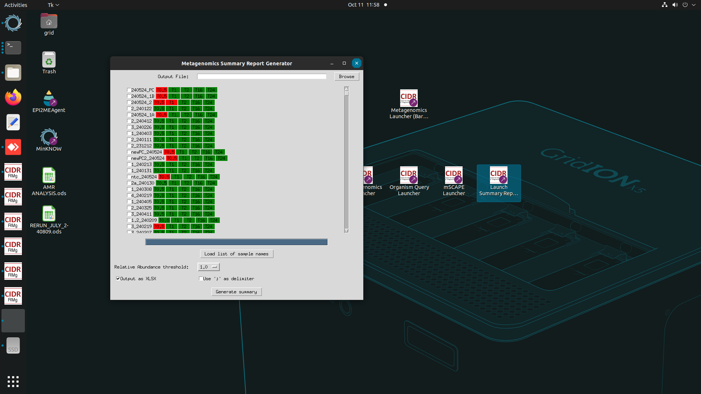

# Summary report generator

## Purpose
We have found it useful to be able to generate summaries of multiple runs for downstream analysis. This takes the form of a spreadsheet or CSV, with rows corresponding to each sample and columns containing information derived from the sample sheet and the metagenomic analyses across timepoints. The tool features an end-to-end GUI to select samples and build the sheet.

!!! danger "Important note"
    We ask that for the NHS RMg service evaluation, you set the Summary Report threshold cut-off to the lowest value (currently 0.1) so that all classifications are included.

A description of the fields featured in the spreadsheet is available [here](#fields-included).

## Instructions for use

*Check out the [video at the bottom of the page](#video-tutorial-manually-selecting-samples) for an end-to-end demonstration*

1. Double click the Launch Summary Report icon on the desktop. The window should appear with a loading bar. Please wait until all of the samples are sourced and loaded.

{data-title="The main window of the summary report generator." data-description=""}

!!! note
    In the above example, we have a list of samples, some of which have red indicators at specific time point. In both instances, it is likely that the reports were not generated because there were no reads present in the dataset. This is an especially frequent occurrence in NTC samples given that few reads should be detected in these samples.

2. The program reads all Metagenomics Workflow runs from the 'results' folder and populates a list. The list has a checkbox to include or exclude samples from the report, and a coloured box indicating the time point is present in the dataset. Select the samples for reporting using one of the two below methods. 
    
    a. Select samples using the check boxes on the interface.
    
    b. Produce a simple list (newline delimited) of sample names, matching exactly (case sensitive) the Sample ID/Accession number used in the Metagenomics run. Save the list in the 'Sample Sheet' directory on the Metagenomics SSD. Select the 'Load list of sample names' button.

3. Choose whether you'd like to export as a spreadsheet (xlsx) or a CSV using the checkboxes at the bottom of the interface.

!!! note
    Both report formats (xlsx/CSV) contain lists of taxa in single cells. In the xlsx, this is delimited by a newline (\n). In the CSV this is swapped for a semicolon ';' to avoid parsing errors.

4. Specify the output location by clicking the 'Browse' button in the 'Output File' section at the top of the interface. Fill out the 'Save As' prompt. **Please be sure add the '.xlsx' or '.csv' file extension to the filename if it not done automatically.**

5. Specify the 'Relative Abundance Threshold'. The default is 1.0%. this default parameter means that no organism < 1% relative abundance will will feature in the output report.

!!! danger "Important note"
    We ask that for the NHS RMg service evaluation, you set the Summary Report threshold cut-off to the lowest value (currently 0.1) so that all classifications are included.

6. Click 'Generate Summary'. The output will appear in the 'summary_report' directory.

### Video tutorial - Manually selecting samples

### Video tutorial - Providing a list of sample names

### Output fields

| Column                                    | Description                                                                                  |
|-------------------------------------------|----------------------------------------------------------------------------------------------|
| **Sample**                                | The Lab/sample ID.             |
| **Experiment**                            | The specific MinKNOW experiment.                            |
| **SampleID**                              | The specific MinKNOW sample.                         |
| **Barcode**                               | The barcode used in the library.                |
| **AnonymisedIdentifier**                  | A de-identified hospital number.           |
| **CollectionDate**                        | The date on which the sample was collected.                                                   |
| **SampleClass**                           | The classification of the sample, PC, NC, NTC, specimen.       |
| **SampleType**                            | The sample site, eg. BAL, SPT, NPS.                                        |
| **Operator**                              | The name or identifier of the individual who processed or sequenced the sample.               |
| **Notes**                                 | Any additional notes or remarks related to the sample or its processing.                      |
| **Total reads XX hrs**                   | The total number of sequencing reads generated after XX hours of sequencing.                 |
| **Human reads XX hrs**                   | The number of reads identified as being from human DNA after XX hours of sequencing.         |
| **Human reads (%) XX hrs**               | The percentage of total reads that are identified as human DNA after XX hours.               |
| **Total classified reads XX hrs**        | The number of reads that have been classified (assigned to an organism or category) after XX hours.|
| **Sequencing N50 (bp) XX hrs**           | The N50 statistic for the reads generated after XX hours, indicating read length distribution.|
| **Proportion >Q15 quality (%) XX hrs**   | The percentage of reads with a quality score greater than Q15 after XX hours.                |
| **Median read quality (PHRED score) XX hrs** | The median PHRED quality score of the reads after XX hours, indicating overall data quality.  |
| **Total bases (bp) XX hrs**              | The total number of base pairs generated by the sequencing run after XX hours.               |
| **Organisms (excluding viruses) XX hrs** | The list of organisms (excluding viruses) identified from the reads after XX hours.          |
| **Organisms (excluding viruses) read counts XX hrs** | The read counts associated with organisms (excluding viruses) after XX hours.               |
| **Organism (excluding viruses) percentage abundance XX hrs** | The percentage abundance of each organism (excluding viruses) in the sample after XX hours. |
| **Viral organisms XX hrs**               | The list of viral organisms identified from the reads after XX hours.                        |
| **Viral read counts XX hrs**             | The read counts associated with viral organisms after XX hours.                              |

