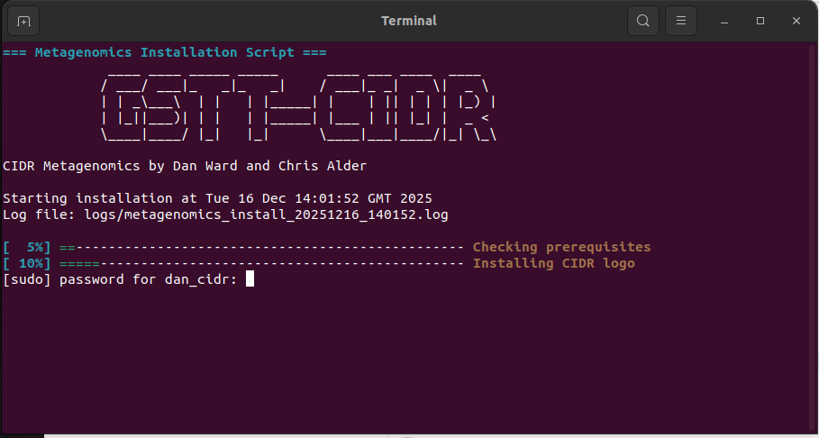
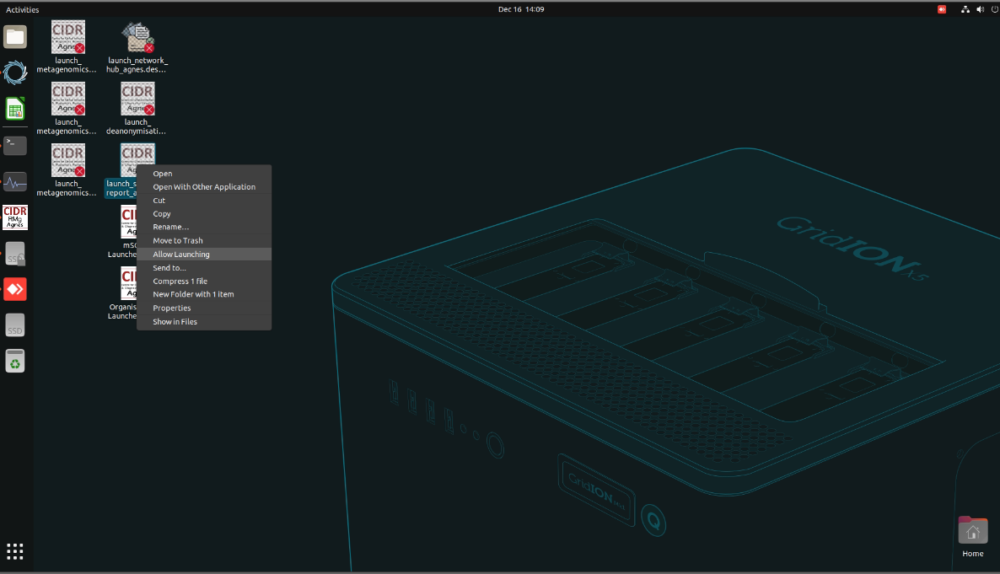

# Installation and Verification

## Requirements

* An ONT sequencing device (with ONT data in the original structure)
* Ubuntu 20 or greater (some VMs are unsupported)
* Root access (required only for install*)
* 64 GB Memory (32 GB for slower turn-around**)
* 18 CPU threads
* 1 TB GB Storage for software only (100 GB without NCBI-nt Organism Query). - Disregard if using SSD.
* 1 TB disk space for sequencing data. 

*Can be circumvented. Manually install libfuse, uidmap and apptainer.

**See 'Limitations -> Running concurrent instances of the workflow' for more info on performance.

## Downloading from the cloud

!!! note "Note"
    For recipients of the NHS RMg platform SSD, please skip to the 'Installation' step

The NHS RMg platform software and databases are ~1 TB in size, which is impractical to distribute over the internet with a simple browser download. Here we provide instructions to download the package using a global cloud infrastructure provider, Cloudflare (similar to AWS). To download the files, we recommend using [Rclone](https://rclone.org/), a widely-used open source tool for interfacing with cloud storage platforms.

1. Download and install rclone by entering the code snippet below in to a linux terminal and following the instructions. You will be prompted for a superuser password. For GridION users, this is usually `grid`.

```
sudo -v ; curl https://rclone.org/install.sh | sudo bash
```

2. Configure rclone with the command below. Swap the KEY1, KEY2 and KEY3 sections with the corresponding keys sent by email and press <kbd>Enter</kbd>. **(All on one line)**

```
rclone config create r2 s3 provider Cloudflare access_key_id KEY1 secret_access_key KEY2 endpoint KEY3
```

3. Find a suitable destination for the download and operation of the workflow. Open that directory in the terminal and execute the command below **(All on one line)**:

```
rclone copy --verbose --checksum r2:rmg-platform-agnes-redist/NHS_RMg_platform/ ./NHS_RMg_platform
```

4. The download can take several days depending on the speed of the connection to download servers. The expected size of the download directory will be shared with the download credentials. Check this matches the download by right-clicking and viewing the 'properties' of the directory.

5. Once the download has completed, set execution permissions for the scripts at the top level of the workflow directory. Open a terminal in the NHS_RMg_platform directory and run:

```
chmod +x *.sh
```

6. Configure the workflow by opening the `NHS_RMg_platform/configs/metagenomics_config_3.8.3_XXX.yaml` in a text editor and modifying the 'device', 'site' and 'timezone' variables. We do not recommend changing other values in this file without consultation.

7. Proceed to the Installation section below.

!!! danger "Warning"
    We recommend a volume with at least 2 TB available space. The storage device should be an appropriately resourced solid-state drive (SSD). Running the workflow from a slower device like an external hard disk drive will result in a significant extension in turn-around-times.

## Installation

1. Navigate to the NHS RMg platform environment on the File Browser application.
    1. SSD storage device recipients, the top level of the NHS_RMg_platform drive.
    2. Download users, this will be the top level of the NHS_RMg_platform directory. 

2. Right click on `launch_installer_**.sh`. Select 'Properties'. Navigate to the 'Permissions' section and select 'Allow executing file as a program'. If it is already checked then skip this step.

!!! danger "Warning"
    Some versions of Ubuntu/Linux will have different processes for enabling execution of the install script and launching. If the script isn't launching or the option to ' Run as a program' does not appear, go to this section on the Network Hub website for a video guide. Or, navigate to the directory in the terminal and run the following:

  ```
  chmod +x *.sh
  ./launch_installer_**.sh
  ```

3. Right click on `launch_installer_**.sh` again and select 'Run as a program'.



4. When prompted for a password, enter the local user's password and press enter. No typed characters will appear as you type.


5. Read the terminal output from the install script to verify correct operation. 


6. Minimise all windows. On the desktop, right click on the grey icons and select 'Allow Launching'



7. See the FAQ section on the Network Hub for any issues.


## Verification

The platform ships with pre-sequenced datasets for *in-silico* workflow verification. These can be accessed through the Metagenomics Workflow launcher as an user-generated sequencing dataset would. Follow the instructions below to verify Metagenomics Workflow operation. 

### Running verification on a <span class="badge-minknow">MinKNOW</span> device.

A full guide on initiating an analysis run can be found in the 'Starting a sequencing experiment and launching metagenomics analysis <span class="badge-minknow">MinKNOW</span>' section of this document. Go to the 'Technical Information -> Metagenomics Workflow' section of this document for a full description of Launcher features. 

1. Open the Metagenomics Launcher by clicking on the desktop icon.

2. Load the 'install_validation.tsv' sample sheet using the 'Load existing sample sheet' function.

3. Launch the analysis. Open the HTML reports in the `NHS_RMg_platform/reports/` directory. 

!!! note "Note"
    * Reports usually take between 10 - 20 minutes to publish after data acquisition timepoints elapse.
    * The workflow generates reports at five timepoints: 0.5, 1, 2, 16, and 24 hours.
    * For real-time sequencing runs, the workflow waits for each timepoint to elapse before publishing the corresponding report, spanning a 24-hour period.
    * For retrospective analysis of existing datasets, reports are generated immediately for the same timepoints based on when the data was originally acquired, without waiting between timepoints.

4. Check the example HTML report here with the 24-hour timepoint output from the validation run. [See report](./reports/demonstration_2/demonstration_2_24_hours_report.html)

5. Any malfunctions or red text in the terminal output, head to the FAQ section on the Network Hub.

### Running verification on a <span class="badge-gourami">Gourami</span> device.

A full guide on initiating an analysis run can be found in the "Starting a sequencing experiment and launching metagenomics analysis <span class="badge-gourami">Gourami</span>" section of this document. Go to the 'Technical Information -> Metagenomics Workflow' section of this document for a full description of Launcher features. 

1. Open the Metagenomics Launcher by clicking on the desktop icon.

2. Click on the 'Force legacy data ingest' button. The launcher window will close and reopen. This step is not necessary for analysing sequencing data generated on the GridION. See 'Technical Information -> Metagenomics Workflow' for more information on this feature.

3. Load the 'install_validation.tsv' sample sheet using the 'Load existing sample sheet' function.

4. Launch the analysis. Open the HTML reports in the `NHS_RMg_platform/reports/` directory. 

!!! note "Note"
    * Reports usually take between 10 - 20 minutes to publish after data acquisition timepoints elapse.
    * The workflow generates reports at five timepoints: 0.5, 1, 2, 16, and 24 hours.
    * For real-time sequencing runs, the workflow waits for each timepoint to elapse before publishing the corresponding report, spanning a 24-hour period.
    * For retrospective analysis of existing datasets, reports are generated immediately for the same timepoints based on when the data was originally acquired, without waiting between timepoints.

4. Check the example HTML report here with the 24-hour timepoint output from the validation run. [See report](./reports/demonstration_2/demonstration_2_24_hours_report.html)

5. Any malfunctions or red text in the terminal output, head to the FAQ section on the Network Hub.
