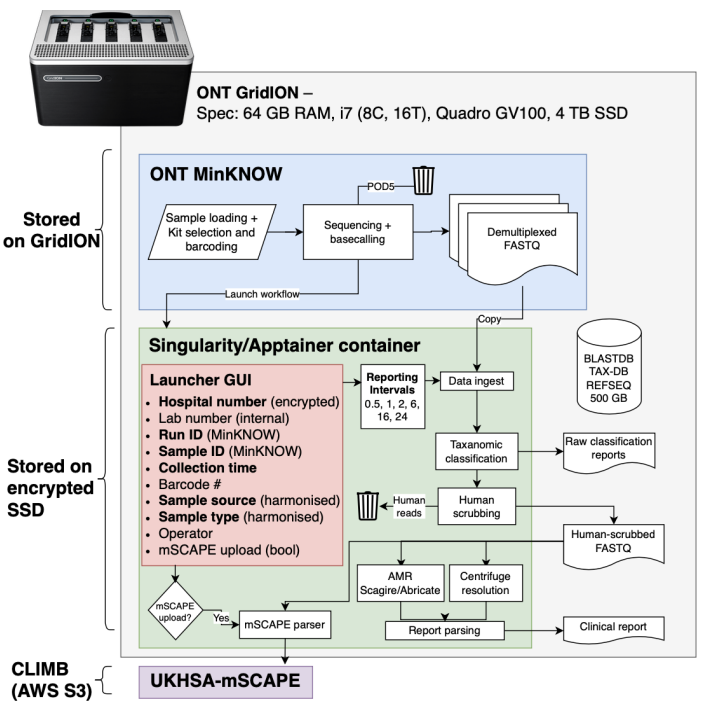

# Clinical metagenomics bioinformatics

## Overview
The principal output of the clinical metagenomics service is a report describing all organisms with detectable nucleic acids (RNA/DNA). The report is generated by the CIDR Metagenomics Pipeline, which can be interpreted by a clinical scientist and a clinician and transmitted in a report similar to that which one would receive from routine microbiology. 

### Technical facets
After loading a library on to an ONT sequencing device and launching the sequencing experiment in ONT MinKNOW, the pipeline is initialised by the user.  It periodically ingests base called FASTQ data from the GridION ```/data/``` directory at set intervals - 0.5, 1, 2, 16 and 24 hours. At each interval, the pipeline performs human scrubbing, taxanomic classification, AMR detection and MLST which is then consolidated in to a PDF reports which are saved in the ```/media/grid/metagenomics/results/``` directory.



#### Taxanomic classification
At its core, the pipeline depends of the process of taxanomic classification, for which there are many tools. Presently we use [Centrifuge](https://ccb.jhu.edu/software/centrifuge/manual.shtml). 