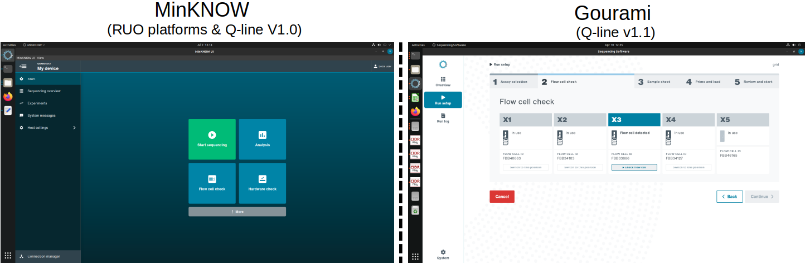

# Metagenomics workflow - 'Agnes' release. 

## Introduction
The **Metagenomics workflow** is the primary analysis tool. It packages a graphical launcher for capturing specimen data from users, and an automated workflow which ingests data periodically from the sequencing device, yielding clear reports shortly after ~40 mins of sequencing. The reports describe the sampled metagenome, leveraging k-mer classification with a bespoke sequence database and a secondary orthogonal analysis tool (Auto Query), with empirically defined thresholds for increased accuracy, and provision for rudimentary AMR detection through gene alignment. 

**Organism Query** is the engine for orthogonal analysis of Metagenomics Workflow outputs. It leverages the NCBI BLASTn toolset with enhanced user-friendly visualisations and summaries, assembled into an information-rich report to inform users further on putative detections. 

**Summary Report** creates spreadsheets and data-scientist-friendly CSV files collating outputs from the workflows for meta-analysis.

For reporting results, see the Clinical Reporting SOP and the UK NHS RMG Guidelines (in press). Please read the ‘Limitations and Known Issues’ section before use.

## Getting started

**The key stages of performing the bioinformatics workflow are as follow:**

1. [Install workflow](./bioinformatics_install.md) (only on first use).
2. [Start MinKNOW sequencing experiment](./running_metagenomics_workflow.md).
3. [Start the Metagenomics workflow](./running_metagenomics_workflow.md).

**Optional:**

4. [Query a classification](./running_organism_query.md).
5. [Upload data to mSCAPE](./mSCAPE_integration.md).
6. Generate a summary spreadsheet.

## Important considerations

1. If using a GridION, do not run more than two concurrent instances of the Metagenomics Launcher application. See 'Technical information -> Running concurrent instances of the workflow' for more information.
2. All outputs from MinKNOW/Gourami and the Metagenomics Workflow must be left in their original output directory output structure for downstream tools to work as intended.
3. References to the 'NHS RMg platform SSD' are made throughout the document. For users who have downloaded the NHS Respiratory Metagenomics Analysis Platform, this term refers to the directory in which the install was run. See the 'Downloading from the cloud' section for more information.
4. Users should provision appropriate backup infrastructure for the NHS RMg platform outputs in the event of disk failure.
5. For mSCAPE users, please refer to the relevant mSCAPE SOP.

## Determine whether you are using MinKNOW or Gourami

Where sections are relevant only to respective platforms, they will be labelled: MinKNOW or Gourami. An absence of labels indicate the process is not platform specific.

## Equipment preparation

* Ensure there is sufficient space for sequencing in the GridION `/data` directory. Users can check available space by opening a terminal <kbd>Ctrl</kbd> + <kbd>Alt</kbd> + <kbd>T</kbd> and typing `df -h` and pressing <kbd>Enter</kbd>. The storage available on the GridION is shown under `/data`.

!!! danger "Warning"
    The SSD drive should be placed on top of the GridION ensuring the removable SSD drive is not in the exhaust path of any device emitting hot air. The SSD is prone to overheating which will cause system instability and analysis failure.

# Citations

For a full list of dependencies, visit our GitHub: https://github.com/GSTT-CIDR

Alcolea-Medina, A., Snell, L. B., Humayun, G., Al-Yaakoubi, N., Ward, D., Alder, C., ... & Whitehorn, J. (2025). Rapid pan-microbial metagenomics for pathogen detection and personalised therapy in the intensive care unit: a single-centre prospective observational study. The Lancet Microbe, 6(10).

Alcolea-Medina, A., Alder, C., Snell, L. B., Charalampous, T., Aydin, A., Nebbia, G., ... & Edgeworth, J. D. (2024). Unified metagenomic method for rapid detection of microorganisms in clinical samples. Communications Medicine, 4(1), 135.

Kim D, Song L, Breitwieser FP, Salzberg SL. Centrifuge: rapid and sensitive classification of metagenomic sequences. Genome Res. 2016;26(12):1721-1729. doi:10.1101/gr.210641.116

Madden, T. (2013). The BLAST sequence analysis tool. The NCBI handbook, 2(5), 425-436

Scagaire, Andrew J Page, Thanh Le Viet, Justin O'Grady https://github.com/quadram-institute-bioscience/scagaire

Seemann T, Abricate, Github https://github.com/tseemann/abricate

CARD - doi:10.1093/nar/gkac920

VFDB - doi:10.1093/nar/gkv1239
