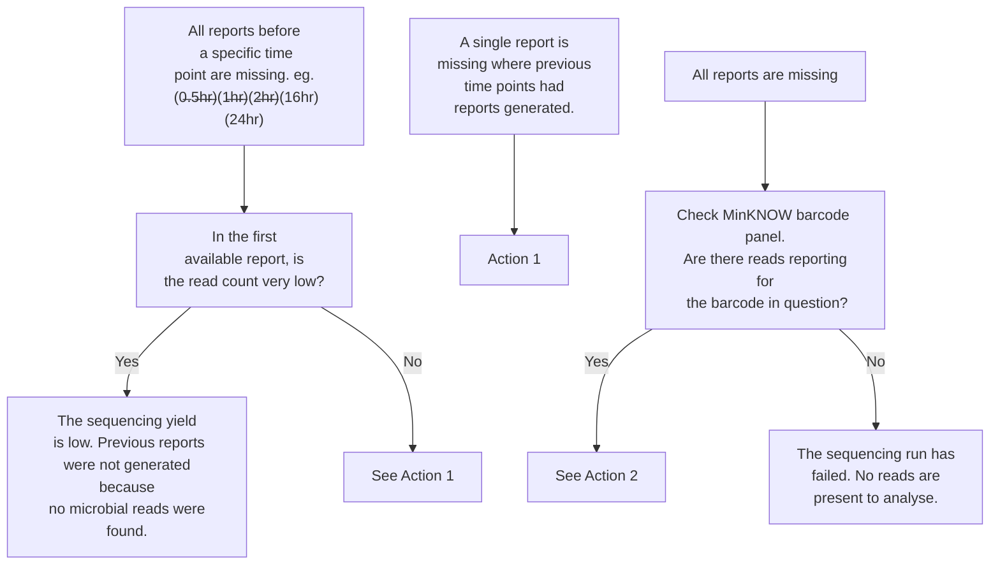

# FAQ

## 1) My 30 minute reports are persistently missing.

### Presentation
During live analysis runs only, the 30-minute reports are not being produced. All other reports are coming out fine. The clock is also running an hour behind (during BST).

### Solution
The GridION is not configured out of the factory for the UK timezone - an issue specifically during BST. this means the data ingest script timings fail and the 30 minute timepoint is missed. **Note - if other reporting timepoints are missing, this is not your solution.**

1. **Type the following in to a terminal window**
    ```sudo timedatectl set-timezone Europe/London```

2. Check the time is correct. If not, [manually update the time](https://help.ubuntu.com/stable/ubuntu-help/clock-set.html.en) to be correct.


## 2) Some timepoint reports are missing from my run.

### Presentation
Entire samples, or timepoint reports are sporadically missing from the report folder. In many cases, reports are not generated because no microbial reads are detected - this causes the pipeline to crash. We are working on improving this error reporting and softer crashes.

There are a number of causes for reports failing. Follow the flowchart to find the correct solution.


### Actions
1. Delete the folders in ```../metagenomics/results``` and ```../metagenomics/reports``` corresponding to the specific sample with issues. Rerun the the pipeline by loading the saved sample sheet. You can do this by using the 'Load Sample Sheet' function on the metagenomics launcher - find the sample sheet corresponding to the date/time. Alternatively, you can re-enter the run information in to the launcher.
 
2. At the moment, no report is generated if the sample consists of human reads only. Run the following command in a terminal - it opens one of the intermediate classification files which we can use to confirm a human-only run. replace {sample_id} with the appropriate (identical) problematic sample IDand {timepoint} with an appropriate timepoint eg. 0.5_hours.
    
    The number 9606 in the terminal output corresponds to the Homo sapiens taxon. If only this is present, the read is human -only. If there are other numbers, try Action 1.

!!! note
    Open the terminal py pressing CTRL-ALT-T
    
``` 
zcat -f /media/grid/metagenomics/results/{sample_id}/{timepoint}/centrifuge/centrifuge_raw.tsv* | awk -F'\t' '{print $3}' | sort -u

```

## 3) My summary report has returned a "....returned non-zero exit status 1" and is not generating spreadsheets.

### Presentation
The summary report tool outputs an error message and does not create a summary report. 

### Actions
The tool should automatically add the correct file extension on to the filename provided by the user. If it has not, add either the '.xlsx' extension or the '.csv' extension depending on your needs.