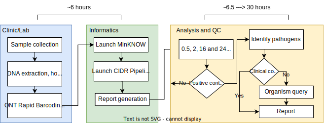

# Metagenomics network information hub

The Network of Excellence is a group of metagenomics ready hospitals and their academic partners. Etc ...Here you can find all the information required to transform respiratory samples in to metagenomic reports for application in the network trial.

**Outline of the workflow**

