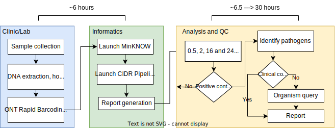

<!-- HTML imports for lightbox image display -->
<head>
<link href="assets/stylesheets/glightbox.min.css" rel="stylesheet"/><style>

</head>
# Metagenomics network hub
The Network Hub is a resource for users of the CIDR clinical metagenomics workflow. Here, you can find SOPs, technical information and FAQ/troubleshooting information.

### Outline of the workflow
The workflow covers the end-to-end processing of respiratory samples, delivering a metageonomic report describing the microbial communities within them. The workflow leverages ONT Nanopore sequencing at its core to produce real-time sequencing data. The informatics workflow runs locally alongside the sequencing experiment, producing reports as early as 30 minutes after commencing sequencing. 

