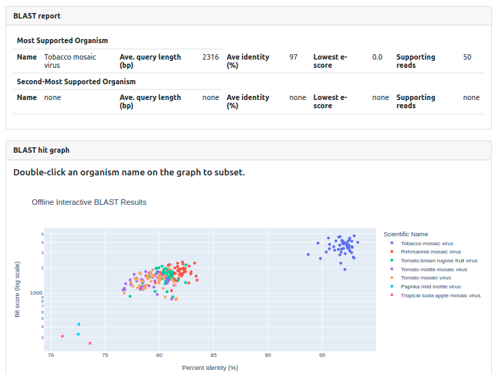
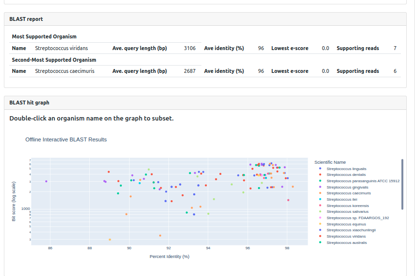
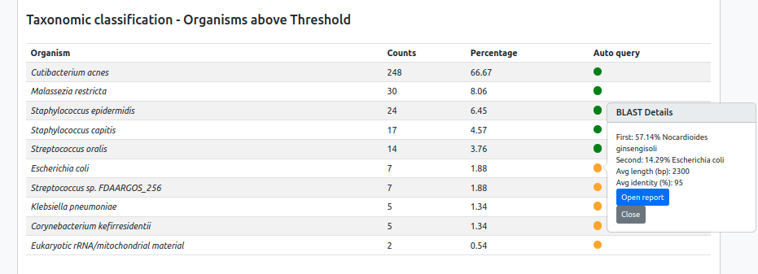
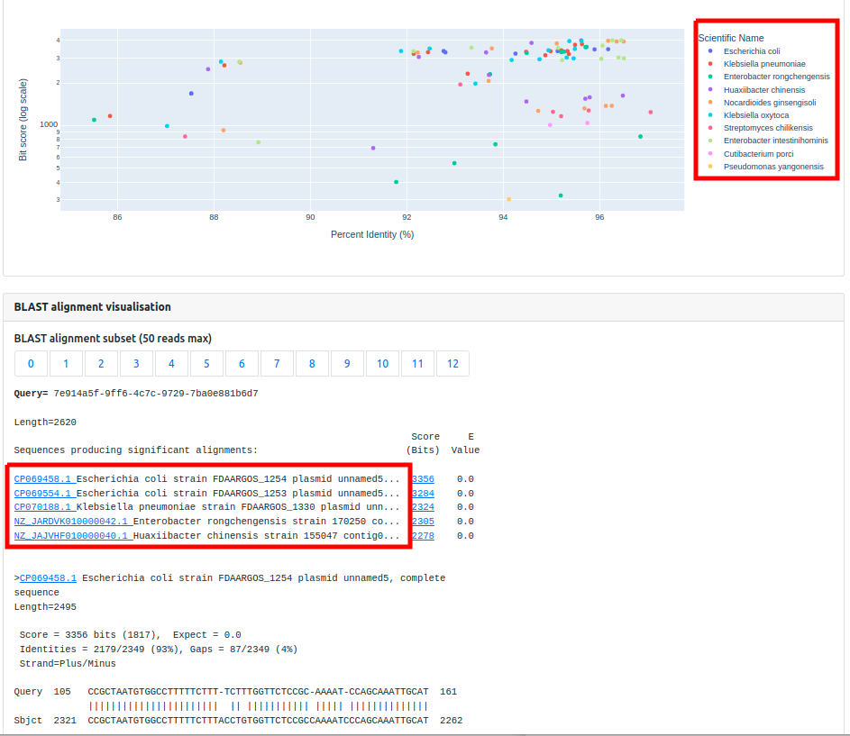

## Interpreting Query results

Organism Query has been designed to help guide decision making in cases where the validity of primary taxonomic classification is in doubt, or a taxon is listed in the Reporting SOP as requiring validation. Organism Query is not a gold standard for classification. Please consult with a bioinformatician if the validity of a detection is in doubt, or request appropriate _in-vitro_ reflex tests. Always follow internal governance.

**Key considerations for analysing Organism Reports:**

* Is there meaningful convergence illustrated on the BLAST report section or BLAST hit graph? i.e. Are the majority of reads supporting the same taxon? Does the graph show a homogeneous plausible cluster of alignments?
* What is the average percent identity of the alignments? Do you expect the identities reported for the subject taxon? Viruses and poorly represented taxa may yield lower identity % than others. Check the alignment for gaps.
* Are the resulting alignments of sufficient length and complexity to yield robust alignments? Short (< 100 bp) or highly repetitive alignments should be disregarded.
* Is the organism in question likely to be included in the database I have chosen?
* Does the query dataset represent sequence suitable for making confident classifications? 
* Many reference sequences contain mobile genetic elements or phage material - these confound Query assignment and should be verified manually (see below).
* Certain genomic loci are highly conserved, such as rRNA genes and mtDNA, yielding ambiguous/undifferentiated alignments. Closely related species and poorly represented genera are particularly prone.

#### Scenario 1:
  
The image below shows two clusters. Is there a consensus cluster with greater % identity and higher bit-score? In this example, we have a homogeneous blue cluster of high identity alignments (~95%) and bit-scores, compared to a less supported cluster of incorrect, closely related taxa with lower identities and bit-scores. Along with 100% reads supporting the same taxon and 98% ave identity this represents a high confidence indication. 

#### Scenario 2:

In the image below there is no clustering. Are the alignment subject taxa closely related and is the identity high? Or does the cluster have a largely low % identity with seemingly unrelated disparate taxa? In this example, it is the former. We have alignments with relatively high average identity (>90%) in a single cluster of _Streptococcus_ spp., which are proving difficult to differentiate consistently. It is therefore not appropriate to attempt a species-level call based on this analysis.

If we see a similar distribution with no distinct clustering, low identity (< 90%) and disparate genera, this usually indicates that there is poor representation for the true query taxon in the chosen database (consider expanding the search) or significant divergence in the query sequence, naturally or artificially (chimera, sequencing/PCR errors etc).

#### Scenario 3 

The image below shows a Negative Control report with several taxa flagged by Auto Query. In this case, both the E.coli and Klebsiella are the product of misclassification through the identification of plasmids associated with a specific reference/taxon. In some cases, plasmids are included in reference sequences which can confound accurate classification when similar plasmids or conserved elements are found in other species.

The next image depicts an Organism Report where the E.coli alignments subjects are primarily plasmid sequences. The detection should be disregarded in this instance. We recommend regularly checking the subject alignments on the Organism Report to verify the detection is not a plasmid.

