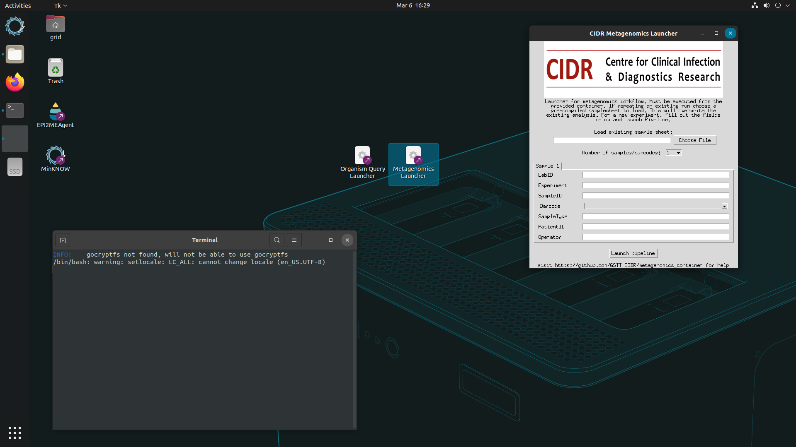

# Running the metagenomics workflow

!!! note "Before starting"
    
    1. The CIDR metagenomics workflow must be started during a sequencing experiment or after a sequencing experiment has completed. The pipeline must not be activated before a sequencing experiment has started in MinKNOW and has **started producing reads** (See MinKNOW setup - Lab Protocol).
    
    2. Ensure the SSD is inserted in to one of the rear USB 3.1 ports, has been mounted and the encryption key has been entered successfully. Test the disk has been mounted by navigating to it in the Ubuntu file explorer.

#### Starting a run
1. Double click the **Metagenomics Launcher** icon on the GridION desktop, the CIDR Metagenomics Launcher should appear alongside a terminal window.

{ data-title="GridION desktop screenshot" data-description="The desktop of the GridION operating system after executing the metagenomics launcher" }

!!! danger "Known issues"
    The ```'geocryptfs error not found...'``` error can be ignored as it is not essential to the workflow.

2. Select the number of samples to be analysed from the dropdown.

3.  You can choose to initiate the launcher using **one** of the below methods:
    * Fill out the fields on the form for each sample to be analysed.
    * Loading a pre-existing TSV - [see example](https://raw.githubusercontent.com/GSTT-CIDR/network_hub/main/example_sample_sheet.tsv?token=GHSAT0AAAAAACMKGNRRLREYQKUOWOVJMRBWZPLABFA).


#### Field descriptions:

| Field      | Description                          |
| ----------- | ------------------------------------ |
|**MinKNOW experiment ID**|The exact name matching the experiment name on MinKNOW entered by the user when initiating a sequencing run. This is populated automatically from the ```/data``` directory. |
|**KinKNOW sample ID**|The exact name matching the Sample name on MinKNOW entered by the user when initiating a sequencing run. This is populated automatically from the ```/data/{experiment_id}/``` directory.|
|**ONT barcode**|The ONT library index/barcode used. Green colour indicates the barcode directory has been validated.|
|**Lab/Sample ID**|The unique lab accession number for the sample. This data is encrypted before transmission.|
|**Hospital number**|Hospital number corresponding to the sample. Can be anonymised. This is encrypted before transmission.|
|**Collection date**|Collection data of the sample.|
|**Sample Class**|The class of sample loaded.|
|**Sample type**|The methodology used to collect the sample.|
|**Operator**|Arbitrary identifier of the user operating the sequencer.|

!!! note
    * Option 1 will generate a sample sheet stored in the ```metagenomics/sample_sheets``` directory. This can be reused if a repeat run is required - or quick edits need to be made to a set of samples without having to fill out the fields again.
    <br><br>
    * For full information on data encryption protocol visit the [mSCAPE uploader](./mSCAPE_integration.md) page.
    <br><br>
    * Test

4. With the metadata form filled, select the run parameter check boxes.

| Parameter     | Description                          |
| ----------- | ------------------------------------ |
|**Force overwrite**|The exact name matching the experiment name on MinKNOW entered by the user when initiating a sequencing run. This is populated automatically from the ```/data``` directory. |
|**mSCAPE prompt**|After the sequencing and analysis run has completed, open the mSCAPE uploader for user input. No data is uploaded without par-sample expressed authorisation.|
|**Disable data ingest sleep**|**Not for real-time analysis!** Analyse all data immediately - do not wait for it to be generated by the sequencer.|
<br>
!!! danger "Known issues"
    You should wait to launch the pipeline after the sequencer has reported producing reads in MinKNOW, the workflow will display errors in red if no reads have been found.
    <br><br>
    The NTC will exhibit the same 'error' behavior as no reads are present in the corresponding barcode folder. We are working on functionality to circumvent this.
    <br><br>
    You can stop the analysis or close the Launcher window at any point by typing ```CTRL+C``` while the terminal window is active and closing the launcher window.

5. Click on ```Launch pipeline``` and click ```OK``` to start analysis.
<br><br>
6. After a minute, the terminal window accompanying the workflow launcher should start displaying log outputs from the workflow. See below for an example.


7. ~40 minutes after launching the sequencing experiment alongside the metagenomics workflow, the first reports will be available in ```/media/grid/metagenomics/reports/{sample_name}/{timepoint}```. See below for a guide on how to access this.


!!! tip "Success!"
    We have now run the CIDR metagenomics workflow. The workflow will run for ~24 hours generating PDF reports for 0.5, 1, 2, 16, 24 hour time-points.

