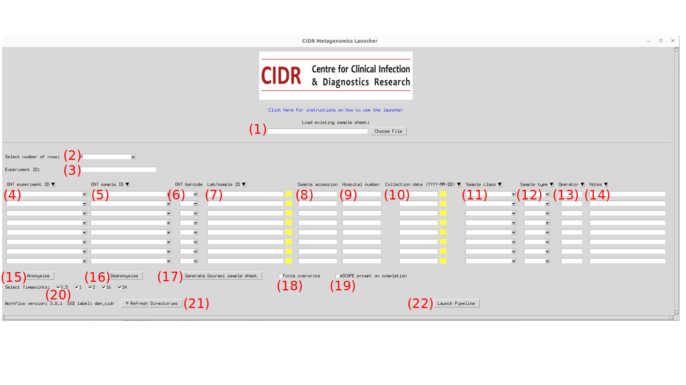

# Launching CIDR metagenomics analysis workflow

!!! note "Before starting"
    
    1. Ensure the SSD is inserted in to one of the rear USB 3.1 ports, has been mounted and the encryption key has been entered successfully.
    <br><br>
    2. For all clinical specimens, positive controls and negatives, a unique Lab/sample ID must be used, taking in to account all previous runs. Positive controls, for example, add the date to each Lab/sample ID (POS_25_01_18) - you can not use only 'POS' as this will overwrite the previous run's control sample with the same name.
    <br><br>
    3. A video demonstration of using the workflow can be found [here](#video-demostration)
#### Launching a run

1. Double click the **Metagenomics Launcher** icon on the GridION desktop, the CIDR Metagenomics Launcher should appear alongside a terminal window.

{ data-title="GridION desktop screenshot" data-description="The CIDR metagenomics workflow launcher" }

!!! danger "Known issues"
    In the terminal, you might see a ```'geocryptfs error not found...'``` error. This can be ignored as it is not essential to the workflow.
<br><br>
2. Select the number of ONT barcodes to be included in the analysis. (Feature 2).
<br><br>
3. Add an appropriate experiment ID to the field (Feature 3). This will label the sample sheet stored in ```./metagenomics/sample_sheets``` which helps identify it when you use them in downstream processes. For Gourami users, this will also set the ONT experiment ID.


#### Feature descriptions:

| Number | Field                             | Description |
|--------|-----------------------------------|-------------|
| 1      | Load existing sample sheet        | Load a pre-existing sample sheet. This will populate the fields below with the data from the TSV file. |
| 2      | Number of samples                 | The number of samples to be analysed. This will create the number of rows in the table below. |
| 3      | Experiment ID                     | Not to be confused with the ONT Experiment ID |
| 4      | ONT experiment ID                 | The exact name matching the experiment name on MinKNOW entered by the user when initiating a sequencing run. This is populated automatically from the /data directory. |
| 5      | ONT sample ID                     | The exact name matching the Sample name on MinKNOW entered by the user when initiating a sequencing run. This is populated automatically from the /data/{experiment_id}/ |
| 6      | ONT barcode                       | The ONT library index/barcode used. Green colour indicates the barcode directory has been validated. |
| 7      | Lab/Sample ID                     | The unique lab accession number for the sample. This data is encrypted before transmission. If repeating a sample, append with _n |
| 8      | Sample accession                  | The lab's sample ID - identifying a specific patient specimen (Anonymised). |
| 9      | Hospital number                   | A value identifying the individual providing the sample (Anonymised). |
| 10     | Collection date                   | The date the specimen was collected. For positive and negative controls, this would be the day of library preparation. |
| 11     | Sample Class                      | The category of the sample loaded. |
| 12     | Sample type                       | The type of specimen. |
| 13     | Operator                          | Identifier for user operating the sequencer. |
| 14     | Notes                             | An open field for notes that will appear on all reports. |
| 15     | Anonymise                         | Anonymises the 'Sample accession' and 'Hospital number' values using an encryption cypher. |
| 16     | Deanonymise                       | Deanonymises the 'Sample accession' and 'Hospital number' values present in the launcher fields to their original values. The deanonymisation tool can be used to access previous runs. |
| 17     | Generate Gourami sample sheet     | Only for Q-line >=v1.1 Generates a Gourami compatible sample sheet for starting a sequencing experiment. The output can be found in the ./metagenomics/sample_Sheet/gourami directory. |
| 18     | Force overwrite                   | Checking this box will move results and reports for all timepoints matching the 'Lab/sample ID' filed in the launcher to the ./metagenomics/recycle_bin directory and 'unlock' all directories. If you have aborted a run, or the terminal is reporting failures, try using this feature. |
| 19     | mSCAPE prompt                     | After the sequencing and analysis run has completed, open the mSCAPE uploader for user input. No data is uploaded without par-sample expressed authorisation. |
| 20     | Select timepoints                 | Select the timepoints you'd like to be generated. If you encounter errors generating a timepoint visit the FAQ section |
| 21     | Refresh directories               | This button refreshes the contents of the MinKNOW experiment ID and MinKNOW sample ID columns. Useful if you have started the launcher before commencing the sequencing experiment. |
| 22     | Launch pipeline                   | Launches metagenomics analysis, saving the sample sheet to the ./metagenomics/sample_sheets. |


!!! note
    Launching an analysis run will save all of the data in the launcher fields to a TSV file in the metagenomics/sample_sheets directory, with the date/time and the contents of the Experiment ID field. This feature makes identifying previous runs in down stream analyses much easier.

4. Fill out the 'ONT Experiment ID' and 'ONT sample ID' drop down menus corresponding to the MinKNOW/Gourami run for the sequencing experiment (Feature 4 and 5). If your experiment is not listed, click the refresh button (Feature 21) or restart the Metagenomics Launcher.
<br><br>

5. Complete the remaining fields using the table above as a guide. The NHS service evaluation and mSCAPE protocols require that all fields are completed.
<br><br>

6. Where required, apply the anonymisation functions to the data using the 'Anonymise' button. This will pseudo-anonymise the 'Sample accession' and 'Hospital number' fields. Users can deanonymise a sample sheet by loading it in to the launcher and selecting 'Deanonymise' or by using the Deanonymisation tool.
<br><br>

7. Click on Launch pipeline and follow the instructions to start the analysis.
<br><br>

8. After a minute, the terminal window accompanying the workflow launcher should start displaying log outputs from the workflow. See below for an example.
<br><br>

9. ~35 minutes after initiating the sequencing experiment followed by the metagenomics workflow, the first reports will be available in /media/grid/metagenomics/reports/{sample_name}/.

!!! note
    Head to the [FAQ section](faq.md) if you encounter any issues with the workflow or launching a run.

### Video demonstration


