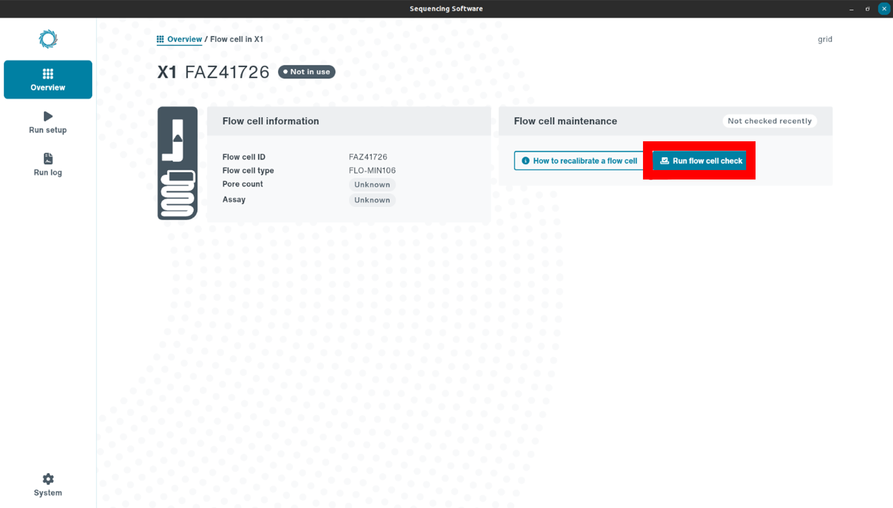
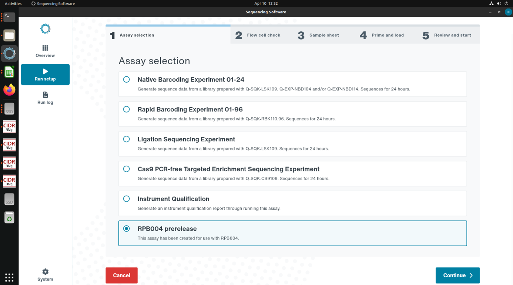
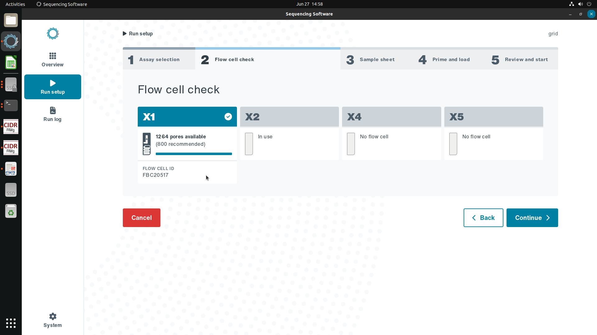
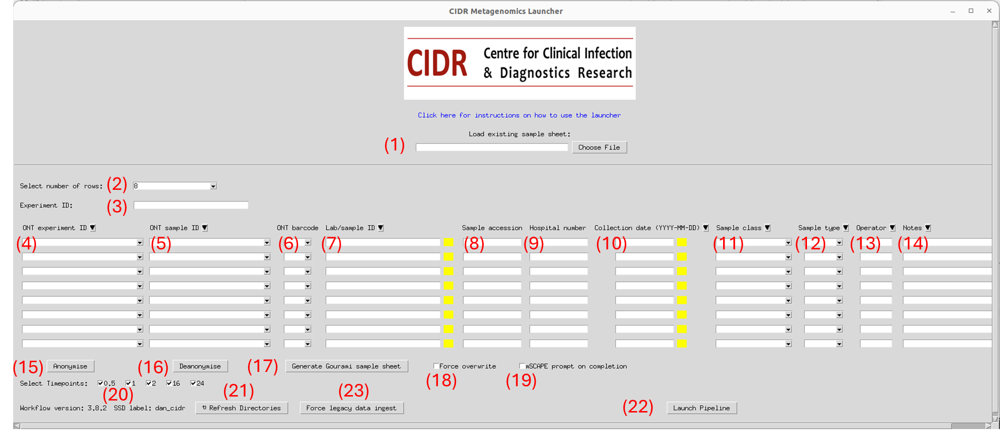
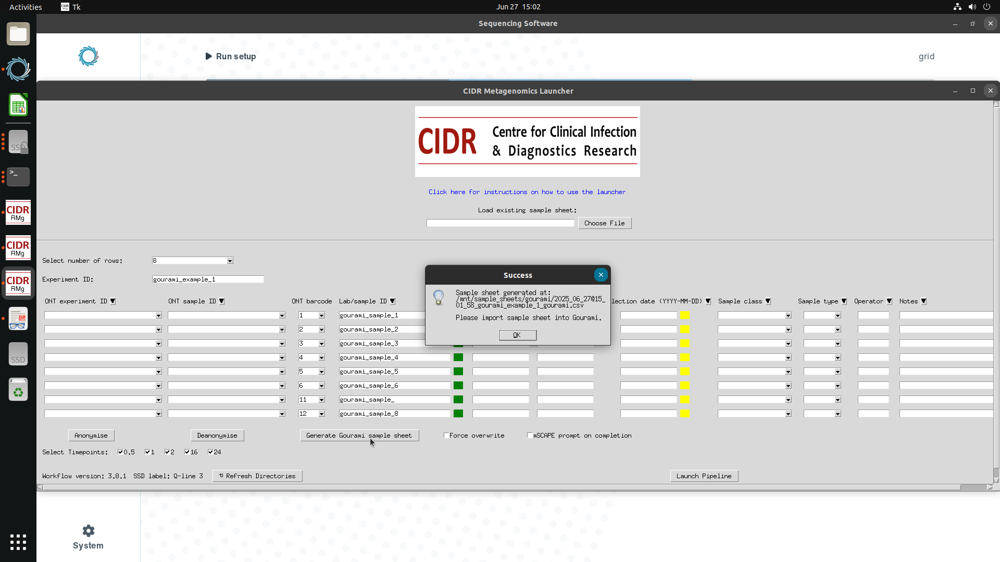
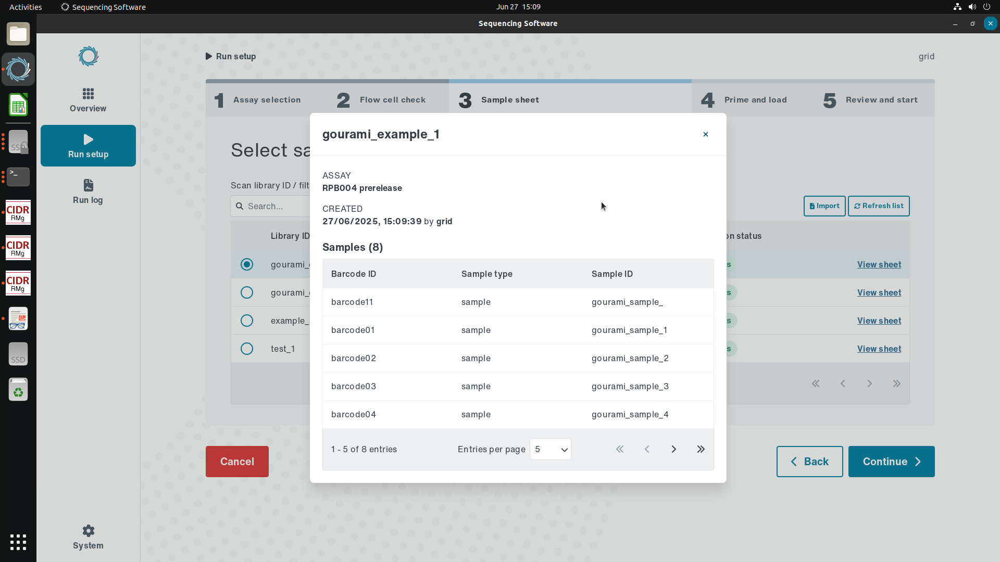
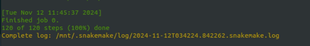

# Starting Metagenomics Experiments

The NHS RMg platform runs separately to the ONT sequencing software. Users should perform steps in the following order:

1. Run a flow cell check.
2. Start the sequencing experiment using the relevant ONT software.
3. Launch the NHS RMg platform analysis.
4. Check the `NHS_RMg_platform/results` directory for reports.

!!! danger "Warning"
    Please read the 'Limitations' section before interpreting outputs.

    On a GridION device, only 2 instances of the workflow can be run simultaneously. See the Limitations section for mitigation.

## Running a flow cell check Gourami

A flow cell check should always be performed before starting a run. Starting a run with sub-optimal pore availability can produce invalid results. Oxford Nanopore Technologies will replace any flow cell that falls below the warranty number of active pores within three months of purchase, provided that you report the results within two days of performing the flow cell check and you have followed the storage recommendations. A MinION flow cell (used also in the GridION) should have > 800 active pores.

1. From the Gourami ‘Overview’ page, select ‘View Flow Cell’ at the appropriate flow cell position.

2. From the flow cell information screen, select ‘Run flow cell check’ on the right-hand side (see Figure 3).

3. If the pore count is < 800 and the flow cell is still in warranty, contact ONT for a replacement within two days of completing the check.

\pagebreak

## Starting a sequencing experiment and initiating metagenomics analysis Gourami

!!! tip "Quick Tip"

  1. A video guide is available on the Network Hub website for this procedure.

  2.  Visit the 'Limitations' section below and FAQs on the Network Hub for an up-to-date description of issues and solutions affecting the workflow results.

  3. Functions referred to in this section will have numeric tag in brackets matching its location on the diagram below. A diagram mapping features is available in the Technical Information section.

1. Open Gourami by clicking on the ONT icon in the taskbar to the left of the screen or on the desktop.

2. In the ‘Run Setup’ section, select “RPB004 prerelease” and press continue.

3. Select the position of the flow cell intended for the sequencing experiment. A flow cell check will be required if not completed already. 

!!! tip "Quick Tip"

  The 'RPB004-prerelease' option may appear differently on your device. Consult with an ONT rep if this option is missing from your device.

4. Switching applications, open the Metagenomics Launcher from the desktop icon. Fill out the the fields on the launcher in the order listed below:

* Number of rows (2)
* Experiment ID (3)
* ONT Barcode (6)
* Lab/Sample ID (7)

5. Click on the 'Generate Gourami sample sheet' button (17). 

6. Switching back to Gourami, import the generated sample sheet. This can be found within the NHS RMg Metagenomics Platform environment at the following path: `NHS_RMg_platform/sample_sheets/gourami/{yyyy_mm_dd@hh_mm_ss_{Experiment ID}`. Validate the entries and click 'Continue'.

7. Prime and load the flow cell as per the relevant laboratory SOP and commence the sequencing experiment. 

8. Wait until the the sequencing experiment has started and at least one barcode/sample status has switched to the green 'Found' status.

\pagebreak

9. Switch back to the Metagenomics Launcher, click on the 'Refresh Directories' button (21) and populate the remaining fields 8-14.

!!! tip "Quick Tip"

  Clicking the black triangle to the right of selected column headers will clone the value in row 1 to all below.

10. Where appropriate, run the Anonymisation Functions (15). See the Anonymisation section for more details on set up and usage.

11. Click on Launch pipeline and click ‘OK to start the analysis’. The window will then freeze until the workflow process has completed. After a minute, the terminal window accompanying the workflow launcher should start displaying log outputs from the workflow. 

12. Approximately 10-15 minutes after the sequencing timepoint, reports will be published to \
`./NHS_RMg_platform/reports/{Lab/SampleID}/`

!!! note "Note"

  * Reports usually take between 10 - 20 minutes to publish after data acquisition timepoints elapse.
  * The workflow generates reports at five timepoints: 0.5, 1, 2, 16, and 24 hours.
  * For real-time sequencing runs, the workflow waits for each timepoint to elapse before publishing the corresponding report, spanning a 24-hour period.
  * For retrospective analysis of existing datasets, reports are generated immediately for the same timepoints based on when the data was originally acquired, without waiting between timepoints.

!!! note "Note"

  For aborted runs, crashes, mislabelling, use the 'Force overwrite' (18) function on the Launcher to delete and replace analysis outputs (results and reports) with a new run. Use this also if a "directory locked" error is observed.

  Any data deleted by this function will be stored in the `./NHS_RMg_platform/recycle_bin` directory.

!!! danger "Warning"

  Do not close the terminal or the Launcher window until all reports have been published or the pipeline has stopped operation.

  For any errors, missing reports or queries, please go to the Troubleshooting section.