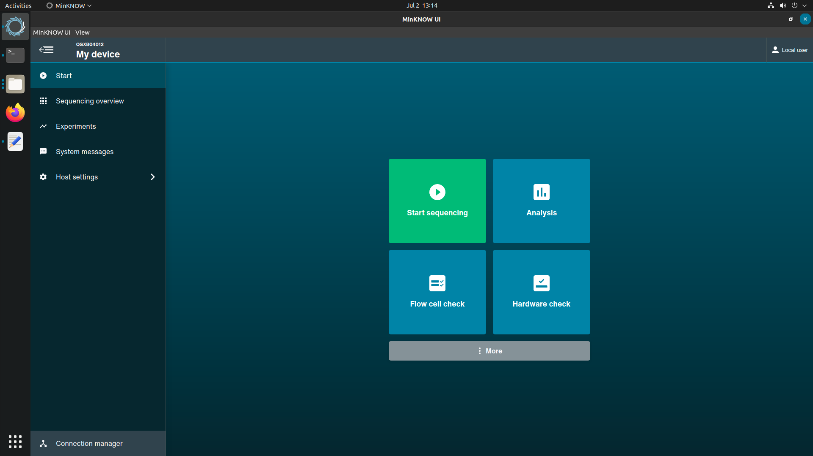
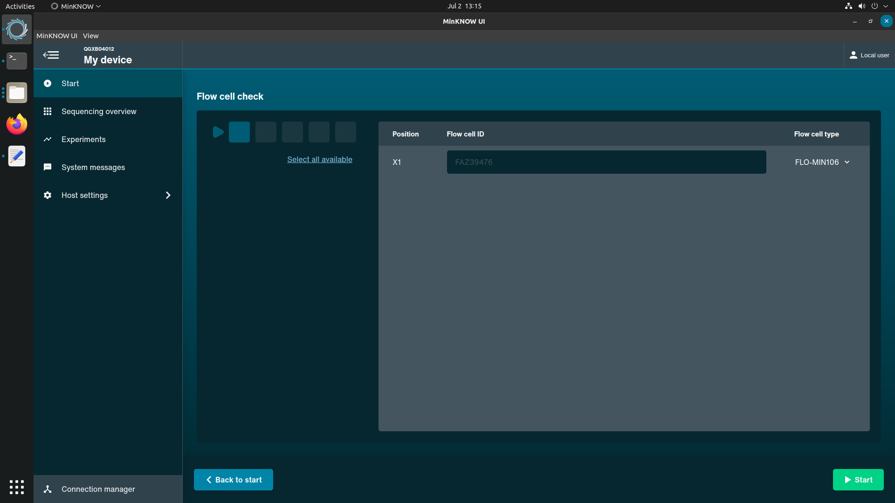
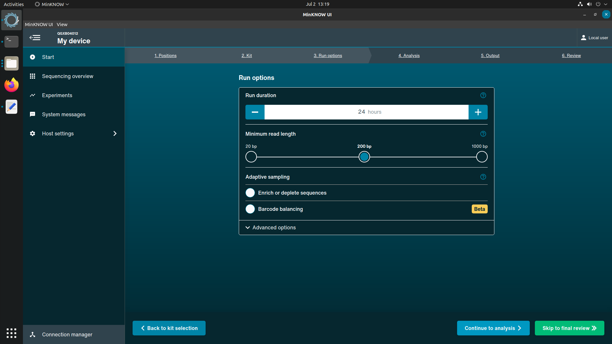
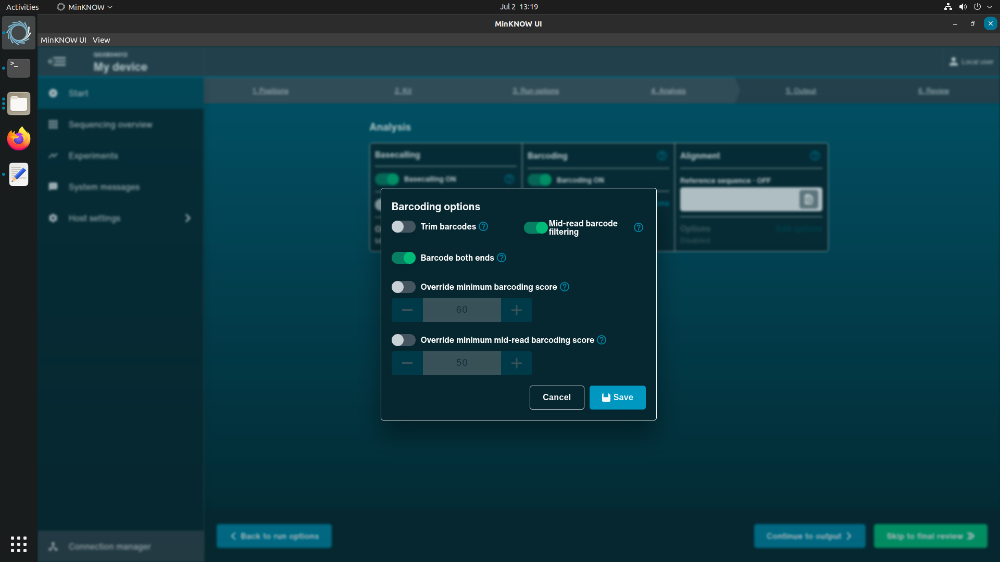
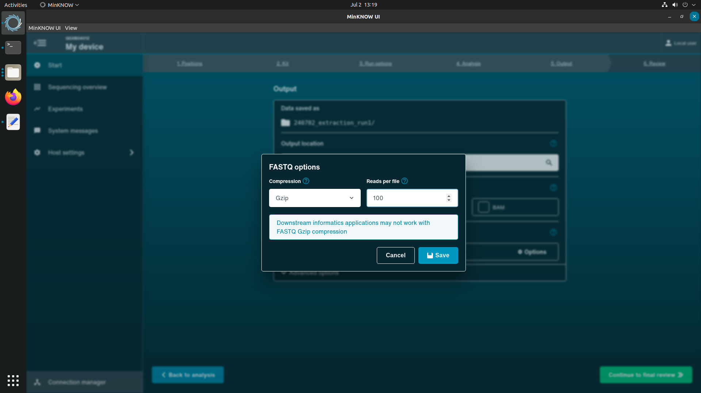

# Starting a sequencing experiment in MinKNOW

## Introduction
This section documents user interactions with the ONT MinKNOW interface. The MinKNOW software is used to initialise and control sequencing experiments on the GridION device. The CIDR Metagenomics Workflow is launched after having completed this section.

Before completing any protocols, users should check flow cells sent to them by ONT are above the warranty pore count. The pore check should be run:

1. As soon as you have recieved a new batch from ONT.
2. Immediately before starting a sequencing experiment.

## Running a flow cell check

Oxford Nanopore Technologies will replace any flow cell that falls below the warranty number of active pores within three months of purchase, provided that you report the results within two days of performing the flow cell check and you have followed the storage recommendations. A MinION flow cell (used also in the GridION) should have 800 pores.

{data-title="Landing screen of ONT MinKNOW software" data-description=""}

1. Select **Flow Cell Check** from the MinKNOW Start screen. 

2. Indicate the corresponding sequencing positions you'd like to check by selecting the square icons below the 'Flow Cell Check' title. (See image below)

3. Click on the green Start button and wait for the flow cell check to complete.

4. If the pore count is < 800 and the flow cell is still in warrant, contact ONT for a replacement within two days of completing the check.

{data-title="flow cell check screen on ONT MinKNOW" data-description=""}
 
 
## Starting a sequencing experiment on MinKNOW

1. From the Start screen in MinKNOW select 'Start Sequencing'.

2. Select the position occupied by the flow cell loaded for the sequencing experiment, enter the Experiment and Sample IDs and select 'Continue to kit selection' at the bottom of the screen.

!!! Note
    You should enter a new and unique Experiment ID and Sample ID for each new sequencing library.
     
    A summary of the configuration parameters is shown at the bottom of this section.

3. Select the RPB-004 library preparation kit from the Kit selection screen. Click 'Continue to run options' at the bottom of the window.

{data-title="Kit selection window for ONT MinKNOW start experiment process" data-description=""}

4. In the run options screen, set the sequencing experiment to last for 24 hours. Leave the read length at 200 bp and the other settings as default and select 'Continue to analysis' at the bottom of the window.

{data-title="Run options window for ONT MinKNOW start experiment process" data-description=""}

5. On the Analysis window, under barcoding, select 'Edit options'. In the popup window, select 'Barcode at both ends' and 'Mid-read barcode filtering'. Select the 'Continue to output' button at the bottom of the window. 

{data-title="Analysis options window for ONT MinKNOW start experiment process" data-description=""}

6. On the Output window, deselect the FAST5 option. Where the FASTQ checkbox is selected, click the gear icon and set 'Reads per file' to 100. Continue to final review.

{data-title="FASTQ output options window for ONT MinKNOW start experiment process" data-description=""}

7. Check the parameters below match what is indicated on-screen. 

| Parameter     | Value                          |
| ----------- | ------------------------------------ |
|**Selected Kit**|SQK-RPB004 |
|**Run length**|24 hours|
|**Minimum read length**|200 bp|
|**Adaptive sampling**|Off|
|**Basecalling**|On (High accuracy basecalling)|
|**Barcoding**|On|
|**Require both ends**|On|
|**Detect mid-read barcodes**|On|
|**Alignment**|Off|
|**Location**|/data|
|**FAST5**|Off|
|**FASTQ**|On (Gzip, 100 reads per file)|
|**Read filtering**|Qscore:9 Readlength: unfiltered, Read splitting: Disabled|

8. Start the sequencing experiment. After the flow cell reaches temperature, navigate to the barcodes screen to verify data has been output.

!!! tip "Success!"
    After reads start to appear on the barcoding screen you can advance to [Starting the metagenomics workflow](./running_metagenomics_workflow.md).