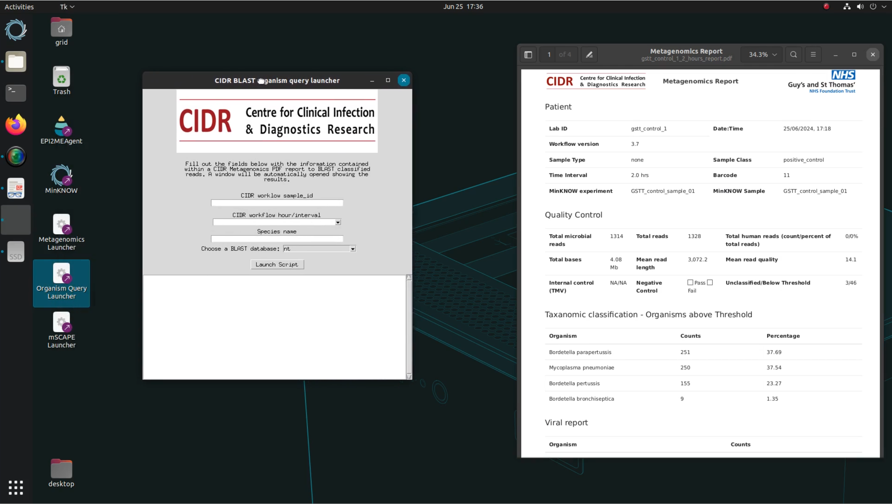

<!-- HTML imports for lightbox image display -->
<head>
<link href="assets/stylesheets/glightbox.min.css" rel="stylesheet"/><style>

</head>

# Bioinformatics - Running metagenomics

# Defaults
singularity exec --bind /tmp/.X11-unix:/tmp/.X11-unix --env DISPLAY=$DISPLAY organism_query_v1.3.sif  /bin/bash -c 'cd /organism_query/ ;source /opt/conda/etc/profile.d/conda.sh && conda activate organism_query && python launcher_defaults.py'