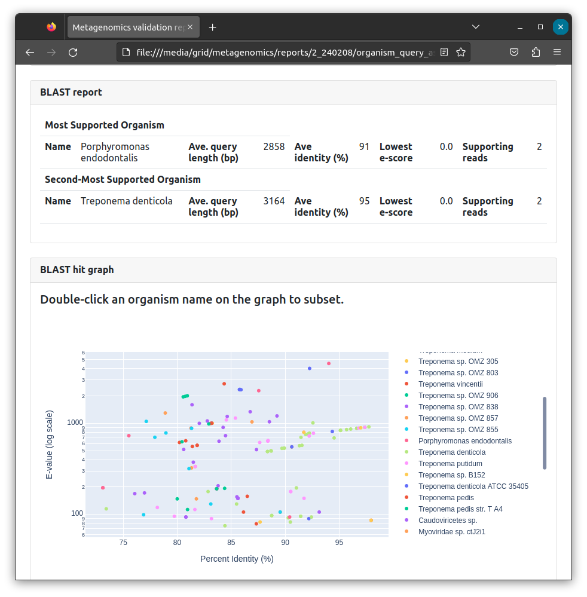
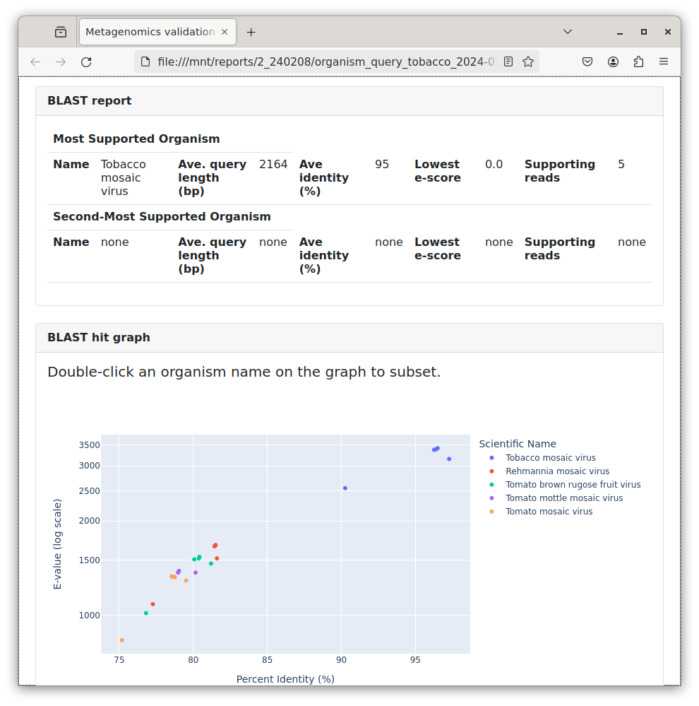
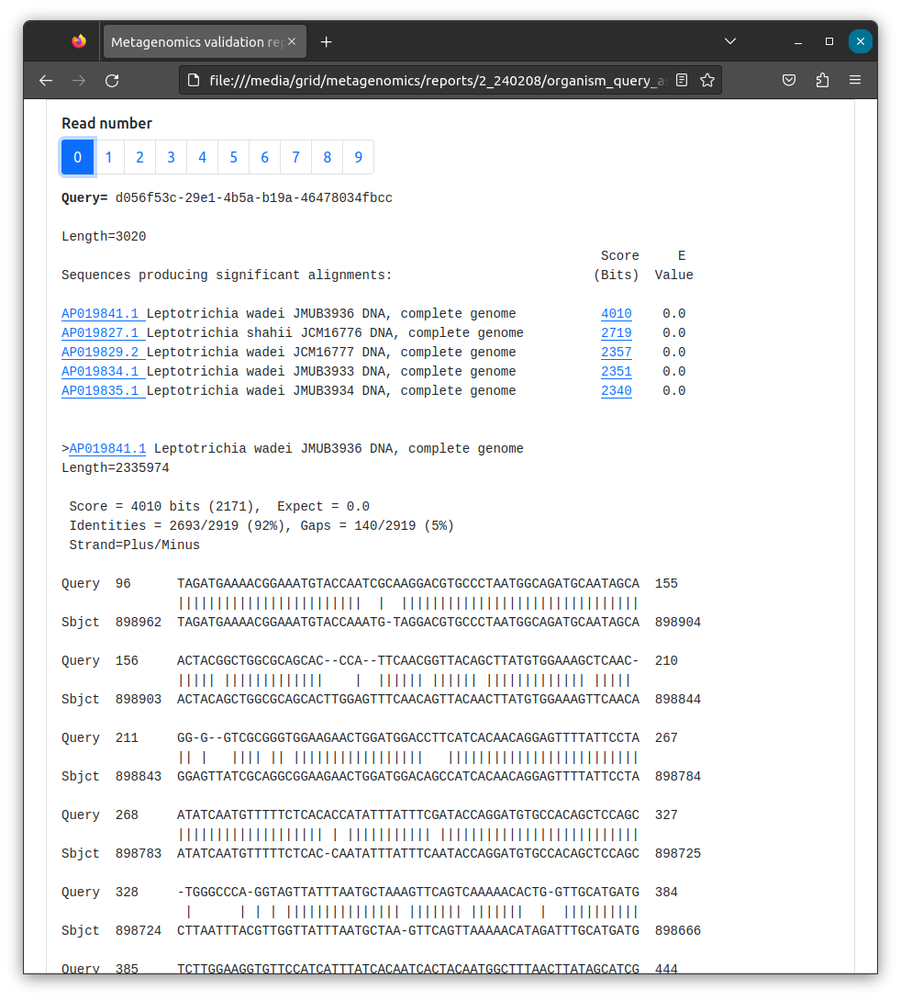

# Bioinformatics - Organism query

The Organism Query tool is designed to help scrutinise taxonomic classification outputs from the CIDR metagenomics workflow. It uses a local (offline) version of NCBI BLASTn, with the full NCBI nt database to produce a report, similar to that found on the NCBI BLAST website, providing the user with a second opinion on classifications.

## Technical information

* The tool searches the classified reads for an organism indicated by the user. Selecting a subset of 10 (max) reads assigned to that taxa.
* The reads are extracted from the FASTQ file stored in the workflow ```results``` folder and BLASTs them against the prescribed database.
* The results are parsed in to a HTML report with an interactive plot designed to help the user explore the different metrics of alignment.
* A full BLAST alignment report is available at the bottom of the HTML report.
* The report is stored in the ```reports/{sample_id}/organism_query_XXX``` folder, with the other PDF reports from the metagenomics run.
* In the report folder is the BLAST HTML report and the subsetted FASTQ and FASTA reads.

!!! info 
    The most thorough analysis is performed using the default nt database. This usually takes ~30 minutes to generate a report.

!!! danger "Known issues"
    The interactive plot is only available immediately after running the tool, when the original Launcher window is open. Loading the query report after closing will allow you to view the BLAST alignments but not the plot section, which will display an 'Internal Server Error'.
    <br><br>
    Running queries simultaneously is currently not supported as the interactive plot function can run a single session. If two reports are opened, the incorrect plot may display on the report. This does not effect the full BLAST analysis, only the plot displayed at that time.


## Launching organism query

1. Load the PDF report from the run you'd like to query a classification from.
<br><br>
2. Click on the Organism Query launcher icon on the GridION desktop.
<br><br>
3. Fill out the fields as indicated in the video below.

| Parameter     | Description                          |
| ----------- | ------------------------------------ |
|**SampleID**|The Lab/Sample ID assigned to the sample when launching the metagenomics workflow. |
|**Workflow hour/interval**|The timepoint, corresponding to the dataset you'd like query.|
|**Species name**|The name of the species to be queried eg. Aspergillus fumigatus|


4. Click on the ```Launch script``` button to start the query workflow. A Firefox browser window will appear after the workflow has finished. You can reopen the report from ```reports/{sample_id}/organism_query_XXX`` on the metagenomics SSD. 

## Interpreting results

Interpreting the results can be subjective. The interactive plot has been designed to help guide decision making. Using a combination of the alignment length (relative to the read length), the identity score and the e-score can be an informative approach.

* Query Coverage: Percent of the query sequence length that is included in alignments against the sequence match.
* E-value: Indicates the number of hits or alignments that are expected to be seen by random chance with the same score or better. The lower the E-value, the more significant the alignment (the closer to 0, the better). E-value is the default metric used to sort the Descriptions table. Click here for a discussion of E-value thresholds.
* Percent Identity: Percent of nucleotides or amino acids that are identical between the aligned query and database sequences. A query sequence can share low percent identity with a sequence and still be a significant hit. It is essential to take the E-value into account and look for similarity between conserved regions (this will be more evident at the amino acid level).

### Interactive plot
In a situation where there is either no confident match or no convergence across the read subset on an organism, or a alignments indicating a number of similar, closely related organisms, the plot appears disordered in a single cluster.


Situations where a convergent set of alignments are indicated results in a plot with two clusters, usually with one clear homogenous taxa. In this case, the Tobacco Mosaic virus.



### BLAST alignments 

Scrolling to the bottom of the report is a conventional BLAST alignment. We recommend looking at each read, the **Length** (query readlength), the **Score** and **Identities** values. 

* If only a small alignment (80 bp) has been made from a long 2000 bp read, this is not likely to be a robust estimation. 
* Check the alignment visualisation for long repeats, regions of low complexity etc. These regions often confound BLAST and taxonomic classification tools.

{ data-title="BLAST screenshot" data-description="An example of a Organism Query BLAST output" }