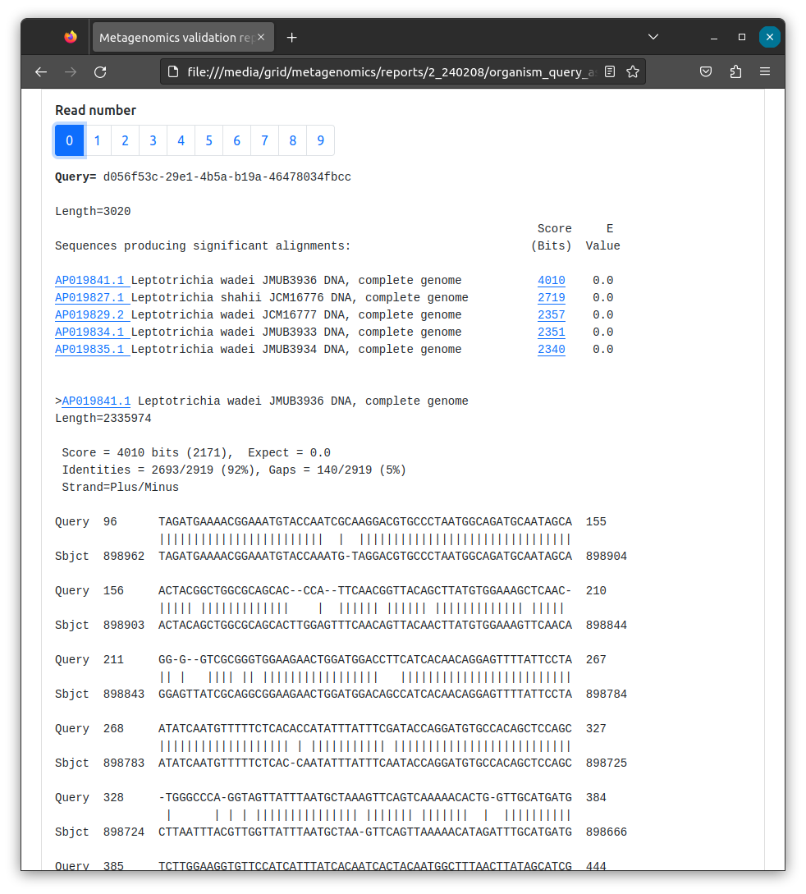

# Bioinformatics - Organism query

The Organism Query tool is designed to help scrutinise taxonomic classification outputs from the CIDR metagenomics workflow. It uses a local (offline) version of NCBI BLASTn, with the full NCBI nt, RefSeq, and CIDR databases to produce a report, similar to that found on the NCBI BLAST website, providing the user with a second opinion on classifications.


!!! note
    The CIDR Metagenomics workflow v3.8.1 runs Organism Query automatically for all non-viral taxa above threshold - see [Auto Query](./auto_query.md).
    <br><br>

## Technical information

* Organism Query searches the classified reads for an organism indicated by the user. Selecting a random subset of 50 reads assigned to that taxon (and taxonomic children).
* The centrifuge score is not considered in this analysis, all reads matching a taxon are valid for selection.
* Reads are extracted from the microbial FASTQ file stored in the workflow ```results/{sample_id}/{timepoint}/microbial``` folder and BLASTed against the indicated database. The queried reads are saved as a FASTA file in the ```./metagenomics/reports/{sample_id}/organism_query_XXX``` directory.
* The results are parsed in to a HTML report with an interactive plot designed to help the user explore the different metrics of alignment.
* A full BLAST alignment report is available at the bottom of the HTML report.
* The report is stored in the ```./metagenomics/reports/{sample_id}/organism_query_XXX``` folder, with the other PDF reports from the metagenomics run.

!!! danger "Caution"
    All NCBI sequence databases can contain contaminated sequences, mis-annotated sequences, sequences that are not representative of the organism they are assigned to.

    While the 'nt' database offers the most comprehensive search, the 'euk', 'prok' and 'viruses' databases are more curated and quicker.


## Launching organism query

1. Load the relevant report for the run you'd like to query.
<br><br>
2. Click on the Organism Query launcher desktop icon.
<br><br>
3. Fill out the fields detailed below. Multiple queries can be run at once by selecting the ```+``` button. A separate report will be generated for each.

| Parameter     | Description                          |
| ----------- | ------------------------------------ |
|**CIDR workflow Lab/sample ID**|The Lab/Sample ID matching that of the report in question. |
|**Workflow hour/interval**|The time-point corresponding to the dataset you'd like query.|
|**Organism keyword**|A keyword identifying the taxa to be queried eg. 'Aspergillus' (capturing all aspergillus spp.) or 'Bordetella parapertussis' for this species and all taxonomic children (eg strains)|
|**BLAST database**| Select the BLASTn database for the search.|

!!! tip "Note"
    Consider using the 'euk', 'prok' or 'viruses' databases for a quick search. The 'nt' database is the most comprehensive, but can be slower to search and may contain more mis-annotated sequences. 


4. Click on the ```Launch script``` button to start the query workflow. A Chrome browser window will appear after the workflow has finished. You can reopen the report from ```reports/{sample_id}/organism_query_XXX`` on the metagenomics SSD. 

## Interpreting Organism Query results

Organism Query has been designed to help guide decision making in cases where the validity of a taxonomic classification is in doubt, or a taxon is listed in the Reporting SOP as requiring validation. Organism Query is not a gold standard for classification. 

Please consult with a bioinformatician if the validity of a detection is in question. Always follow local governance and perform reflex testing where appropriate. 

### Key metrics
* Query Coverage: Percent of the query sequence length that is included in alignments against the sequence match.
* E-value: Indicates the number of hits or alignments that are expected to be seen by random chance with the same score or better. The lower the E-value, the more significant the alignment (the closer to 0, the better). E-value is the default metric used to sort the Descriptions table. Click here for a discussion of E-value thresholds.
* Percent Identity: Percent of nucleotides or amino acids that are identical between the aligned query and database sequences. A query sequence can share low percent identity with a sequence and still be a significant hit. It is essential to take the E-value into account and look for similarity between conserved regions (this will be more evident at the amino acid level).
* Ave. query length: Average length of the input query sequencing read.
'Supporting reads': The number of reads for which that taxon is the highest scored alignment.

### Interactive plot
Is there meaningful convergence or clustering in the classification of reads? 

See Figure 8. The plot shows two clusters. Is there a consensus cluster with greater % identity and higher bit-score? In this example, we have a homogeneous blue cluster of high identity alignments (~95%) and bit-scores, compared to a less supported cluster of incorrect, closely related taxa with lower identities and bit-scores. 

See Figure 9. One cluster is present. Are the classifications closely related and is the identity high? Or does the cluster have a largely low % identity with seemingly unrelated disparate taxa? In this example, it is the former. We have reads with relatively high identity >80% all forming alignments within a genus, Treponema spp., yielding no clear consensus cluster. In this case, we can be fairly sure we are dealing with Treponema spp. as the identity and bit-scores are high. Given the clinical context (a respiratory sample), I might classify these as Treponema denticola.  

Figure 9 Organism query interactive plot - undistinguished outputs 

On changing the colour variable to ‘Query read ID’, are there any patterns shown? Specifically, are clusters on the plot formed from the same read(s) or comprise many different reads. If clusters are formed from single reads, it may be the case that reads in the analysis are from different organisms and results may not be valid. 

### BLAST alignments 

Scrolling to the bottom of the report is a conventional BLAST alignment. We recommend looking at each read, the **Length** (query readlength), the **Score** and **Identities** values. 

* If only a small alignment (80 bp) has been made from a long 2000 bp read, this is not likely to be a robust estimation. 
* Check the alignment visualisation for long repeats, regions of low complexity etc. These regions often confound BLAST and taxonomic classification tools.

{ data-title="BLAST screenshot" data-description="An example of a Organism Query BLAST output" }