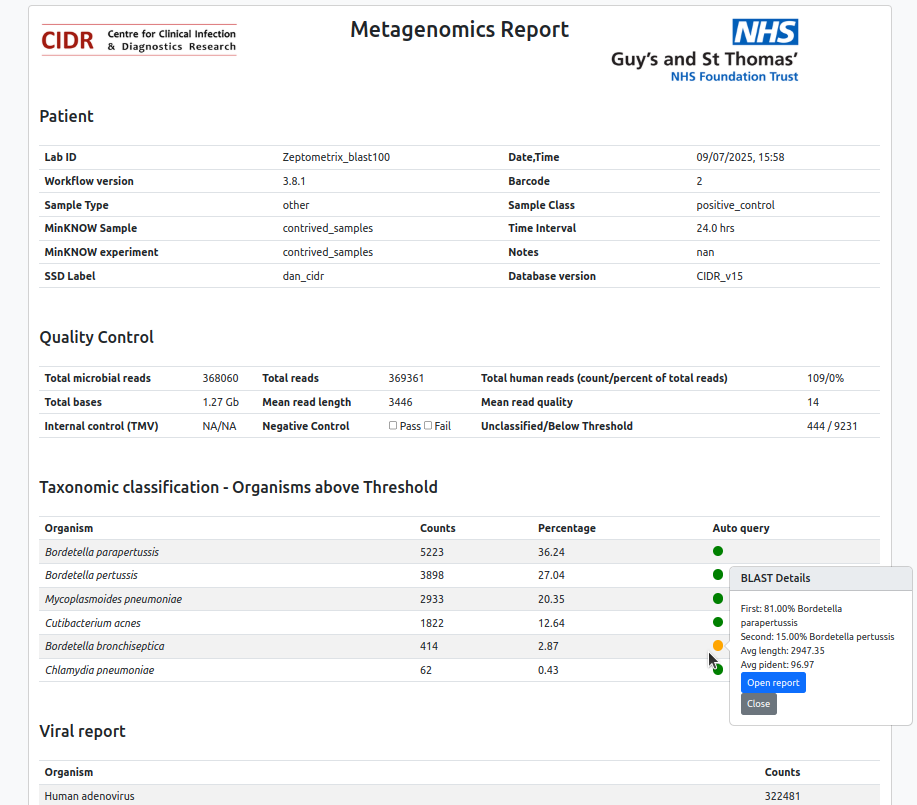
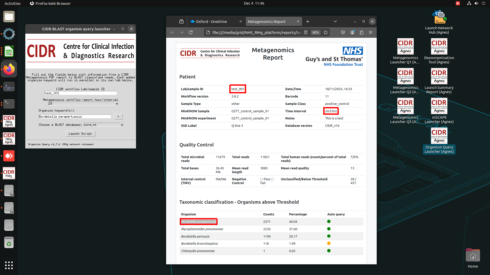
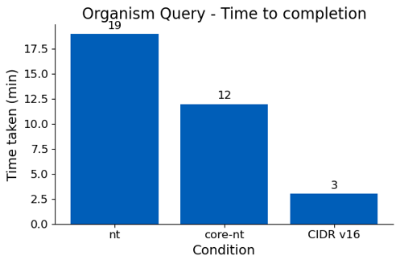

# Secondary (orthogonal) classification analysis

The Organism Query platform is provided to enable further scrutiny of taxonomic classification outputs from the CIDR metagenomics workflow. This tool serves both the Auto Query (*traffic light*) function on the Metagenomics Workflow outputs and the manual Organism Query interface. It leverages a local (offline) implementation of NCBI BLASTn to analyse a subset of reads from a given detection, summarised in a portable HTML report, with added analyses and logic to consolidate and visualise results.

!!! danger "Warning"
    The 'Unclassified' analysis function in the v1.7.1 release may not be able to find unclassified reads despite them being present. Go to the FAQ section on the network hub for the fix.

## Auto Query

The Metagenomics Workflow submits reads to Organism Query automatically for non-viral detections above threshold or organisms on the Exception List (See 'Technical information -> Metagenomics Workflow' for more information and configuration). Auto Query results are summarised on the Metagenomics Reports in two tiers. First, the *traffic light* system, which communicates concordance between primary classification (k-mer - centrifuge) and secondary (orthogonal) classification Auto Query results. Importantly, like all outputs of this workflow, indications made by this function are not guaranteed to be accurate. A green light indicates that no discrepancy was detected between classification stages, it does not infer certainty. 

* A green circle indicates that > 50% of the highest ranking BLAST alignments in the analysis match the taxon identified in primary classification. i.e. In a standard 25 read subsample, > 12 of the reads' best alignments match the taxon indicated on the report. 
* A yellow circle indicates that < 50% of the highest ranking BLAST alignments in the analysis match the taxon identified in primary classification. Amber indicators on clinically-relevant detections should always be investigated further. 
* A gray circle indicates that either the analysis/process failed or there were no alignments resulting from the query reads provided. Repeat the analysis using a larger database via the Organism Query tool.
* A blue circle indicates the taxon in question was not eligible for Auto Query analysis, due to it being below threshold. Use the manual Organism Query tool to analyse these taxa further. 

The auto query database contains a similar set of sequences to the primary classification database, with the addition of RefSeq prokaryote and virus representatives.

Take a look at an example report here to familiarise yourself with the interface: [See report](./reports/demonstration_2/demonstration_2_24_hours_report.html)

**More information on configuring this function and its thresholds can be found in the 'Technical Information -> Metagenomics config parameters' section.**

The second tier of results are revealed when the *traffic light* is clicked on. The popover contains a brief summary of the Organism Query metrics, which are **derived only from the best (highest scoring) BLAST alignment** for each query read. These include:

* **'First'** - The most frequently observed alignment subject taxon, and the percentage representation of that taxon in the Query subsample.
* **Second** - The second-most frequently observed alignment subject taxon, and the percentage representation of that taxon in the Query dataset.
* **Avg length** - The average length (sequence overlap) of the alignments.
* **Avg identity** - Average percentage of identical positions across alignments.

The 'Open Report' button links to the full Organism Query report. Go to the 'Interpreting an Organism Query report' section for a guide on Auto Query reports.

!!! danger "Warning"
    The Auto Query traffic light tooltip popups will not appear when clicked if there is insufficient room on the browser window. Increase the size of the window, scroll up/down or zoom out if the tooltip is not appearing.

## Organism Query

Organism Query is an interface for manually initiating BLAST analyses on taxa identified in Metagenomics reports. Its main uses, aside from those covered by Auto Query, are:

* Users can query reads from taxa above or below threshold at any timepoint.
* Users can select which BLAST database to use, including domain-specific Refseq databases, nt-core and nt.
* Users can query a small subset of unclassified reads.
* Organism Query by default analyses 50 reads.

### Initiating an Organism Query

1. Double click on the 'Organism Query' icon on the desktop.

2. Open the Metagenomics Report with the taxon on you'd like to query.

3. Fill out the four fields (highlighted on the image below):

  1. Lab/Sample ID.
  2. Workflow interval (timepoint).
  3. Organism Keyword - Copy and paste as it appears on the report. Any taxa below the rank of the keyword will be included in the search. 
  4. Choose the BLAST subject database. (See below)

4. Click on 'Launch Script' to begin. The attached debugging output will display analysis progress.

5. The Organism Report should appear automatically. If it does not, navigate to the `NHS_RMg_platform/reports/{sample_id}/organism_query_{query_organism}_{datetime}/organism_report.html` and open in browser.

!!! tip "Quick Tip"
    In addition to exact organism names, uses can put a genus, strain or 'Unclassified' in to the Organism Keyword field. The latter will query Unclassified reads.

#### Choosing a BLAST database

BLAST databases contain the reference sequences used to screen queries. Results can be vastly different and possibly misleading if the wrong database is chosen. A conventional NCBI Online BLAST search utilises the 'core-nt' database. We recommend a tiered approach when choosing a database for Queries. Starting your investigation with fast and curated databases, ending with the largest and most inclusive, balancing reliability and turn-around-time. It's important to consider that the 'nt' databases are not curated and therefore could produce misleading results.

1. Auto Query database (CIDR_vXX) - Curated, inclusive and fast. Will produce similar results to Auto Query results. Contains a mirror of the CIDR_v16 Centrifuge database (Human, parasites, fungi, virus and prokaryote genomes), with the addition of Refseq virus and prokaryotic databases.

2. RefSeq - euk, prok, viruses or all. NCBI Refseq (a curated database) representative genomes split by domain or all together. Using the 'Refseq Viruses' database takes < 1 minute and is perfect for investigating high-confidence viral detections further.

3. core-nt and nt - nucleotide sequence database, with entries from all traditional divisions of GenBank, EMBL, and DDBJ; excluding bulk divisions (gss, sts, pat, est, htg). core-nt is more compact, and therefore runs faster. It enables faster searches, but is lacking large eukaryotic chromosomal assemblies.

{width=50%}

!!! danger "Warning"
    Misclassification can occur when no representaive for a query read is present in a reference database.

    Choosing a domain-specific databases can produce misleading results if the true query origin is not contained within the database/domain chosen.

