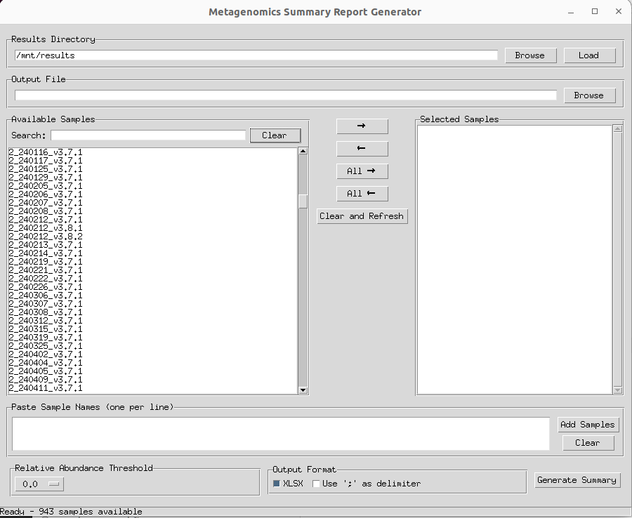
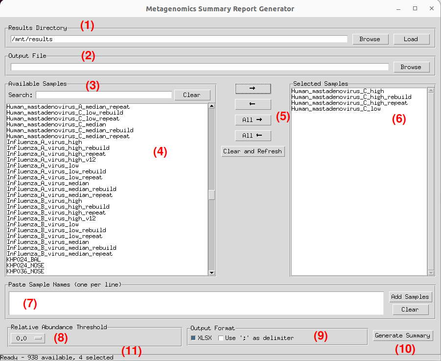

# Running Summary Report

1. Double click the Summary Report icon on the Desktop.

2. Select the samples to be added to the Summary Report. This can be achieved by three methods:
    * Selecting samples, holding `shift` or `ctrl` and move them across to the right panel using the right-facing arrow button.
    * Use the search function to subset the available samples and select as above.
    * Paste a newline delimited list of sample names, exactly matching the name as it appears in the `results` directory, to the Paste Bin (Feature 7) and click 'Add Samples'. 

3. Decide the output format for the report data.

4. By the 'Output File' section select 'Browse' and choose the destination and appropriate file extension for the output. 

5. Click on 'Generate Summary' to build the Summary Report. The bottom-left corner has a status indicator. View the terminal outputs for further information and debugging. 

!!! tip "Quick Tip"

    Note: The tools save files by default to directories on the storage medium or in the analysis environment file structure. Navigate to the top (root) level in any 'save' dialogue box and choose `home` to save to the host machine's local storage.

# Description of features

See the diagram below and the associated table for explanations on Summary Report features.

|Number| Feature | Description|
|---|---|---|
|1| Results directory | Path selection for the Metagenomics Workflow's `results` directory. Useful if users move/organise outputs for archiving.*
|2| Output file | The output file path for Summary Report.|
|3| Sample search bar | Enter key phrases to subset available samples. |
|4| Available Samples panel | Populated automatically from the provided `results` directory.|
|5| Sample selection controls | Move selected or all samples to and from the Selected Samples panel. Clear and refresh to start again.|
|6| Selected Samples panel | A list of the samples included for summary |
|7| Sample paste bin | Paste a list (newline delimited) of sample names from an external source to quickly load on to Selected Samples.**|
|8| Relative abundance | Set a threshold of relative abundance for the non-viral taxa. Taxa falling below will be excluded entirely from the report.|
|9| Format output | Change default XLSX output to CSV. Change janky newline delimitation of nested lists to ';' for easier parsing.|
|10| Generate summary| Run the script|
|11| Status indicator| Data on available samples and selections|

: Summary report diagram legend 

*Will not be able to see outside of mounted directories of the container (Default: the NHS RMg platform SSD). Modify the launch script to mount additional host directories.
**No path checking is performed on pasted samples. They will be excluded from the Summary Report if missing. See terminal output for list of missing samples.

# Description of outputs

| Column Name | Explanation|
|--------|------|
|Sample|LabID provided on launching the Metagenomics Workflow|
|Experiment| The exact name matching the experiment name on MinKNOW entered by the user when initiating a sequencing run. This is populated automatically from the /data directory. |
|SampleID| The exact name matching the Sample name on MinKNOW entered by the user when initiating a sequencing run. This is populated automatically from the /data/{experiment_id}/ |
|Barcode| The ONT library index/barcode used. Green colour indicates the barcode directory has been validated. |
|LabID|LabID provided on launching the Metagenomics Workflow|
|biosample_id| The Sample Accession (if provided). May also be an anonymised study number derived from the Sample Accession.|
|biosample_source_id| The Hospital number provided to the Metagenomics Launcher.  May also be an anonymised study number derived from the Hospital Number.|
|Collection Date| Provided to the Metagenomics Launcher|
|SampleClass| Specimen, postive contol, standard etc. Provided to the launcher.|
|SampleType| Sampling site: BAL, SPT, NDL, ETT, NPA, PFL etc.|
|Operator| Operator initials. Sourced from Launcher.|
|Notes| Additional notes. Sourced from Launcher, shown or reports.|
|RunID| Identifier assigned to the experiment by the sequencing device. Derived from FASTQ.|
|Flow_Cell_ID| Flow cell ID - derived from FASTQ|
|Total reads X hrs| Total reads - pre-human scrubbing|
|Human reads X hrs| Human reads removed  |
|Human reads (%) X hrs| Proportion of total reads identified as human and removed|
|Total classified reads X hrs| Total reads post-human scrubbing |
|Sequencing N50 (bp) X hrs| Post human-scrubbing (microbial reads) read length metric |
|Proportion >Q15 quality (%) X hrs| Proportion of microbial reads with a PHRED score >15|
|Median read quality (PHRED score) N | Median PHRED core for microbial reads|
|Total bases (bp) X hrs | Total bases sequenced including human|
|Organisms (excluding viruses) X hrs| A list of organism identified except for viruses|
|Organisms (excluding viruses) read counts X hrs| Counts of reads for each non-viral taxa identified|
|Organism (excluding viruses) percentage abundance X hrs| 
|Viral organisms X hrs| Virus taxa list |
|Viral read counts X hrs| Counts of viruses identified |
|Auto Query top taxon X hrs| Auto Query's most supported taxon - note by default taxa below threshold will not be subject to Auto Query an therefore will be shown as 'missing' here. See 'configuration' section for more info.|
|Auto Query top percent X hrs | The percentage of top alignments supporting the the top taxon|
|Auto Query 2nd taxon X hrs|  |  The percentage of top alignments supporting the the second most frequent taxon|
|Auto Query 2nd percent X hrs| Auto Query's second most supported taxon|
|AvgLength 0.5 hrs| Average length of Auto Query alignments for the top hit | 
|AvgPID 0.5 hrs| Average percent identity of Auto Query alignments for the top hit |
|IsMatched50 0.5 hrs| Would a 'green light' be shown on the report |

: Summary report output fields 
