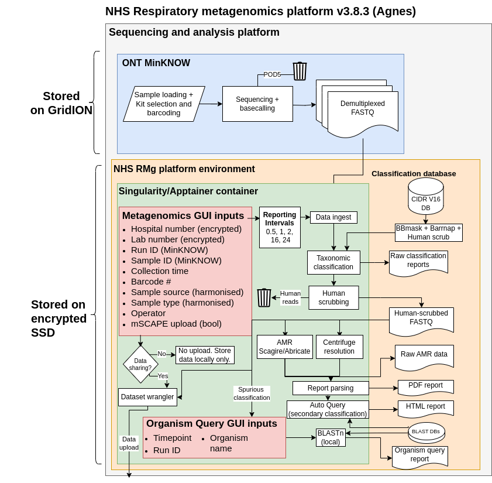

# Technical Information

## Metagenomics Workflow

\* Data sharing processes are removed for all NHS-external distributions.

### Feature descriptions:

| Number| Field| Description |
|--------|------|-------------|
| 1      | Load existing sample sheet| Load a pre-existing sample sheet. This will populate the fields below with the data from the TSV file. |
| 2      | Number of samples| The number of samples to be analysed. This will create the number of rows in the table below. |
| 3      | Experiment ID| Not to be confused with the ONT Experiment ID |
| 4      | ONT experiment ID| The exact name matching the experiment name on MinKNOW entered by the user when initiating a sequencing run. This is populated automatically from the /data directory. |
| 5      | ONT sample ID| The exact name matching the Sample name on MinKNOW entered by the user when initiating a sequencing run. This is populated automatically from the /data/{experiment_id}/ |
| 6      | ONT barcode| The ONT library index/barcode used. Green colour indicates the barcode directory has been validated. |
| 7      | Lab/Sample ID| The unique lab accession number for the sample. This data is encrypted before transmission. If repeating a sample, append with _n |
| 8      | Sample accession| The lab's sample ID - identifying a specific patient specimen (Anonymised). |
| 9      | Hospital number| A value identifying the individual providing the sample (Anonymised). |
| 10     | Collection date| The date the specimen was collected. For positive and negative controls, this would be the day of library preparation. |
| 11     | Sample Class| The category of the sample loaded. |
| 12     | Sample type| The type of specimen. |
| 13     | Operator| Identifier for user operating the sequencer. |
| 14     | Notes| An open field for notes that will appear on all reports. |
| 15     | Anonymise| Anonymises the 'Sample accession' and 'Hospital number' values using an encryption cypher. |
| 16     | Deanonymise| Deanonymises the 'Sample accession' and 'Hospital number' values present in the launcher fields to their original values. The deanonymisation tool can be used to access previous runs. |
| 17     | Generate Gourami sample sheet| Only for Q-line >=v1.1 Generates a Gourami compatible sample sheet for starting a sequencing experiment. The output can be found in the ./NHS_RMg_platform/sample_Sheet/gourami directory. |
| 18     | Force overwrite| Checking this box will move results and reports for all timepoints matching the 'Lab/sample ID' filed in the launcher to the ./NHS_RMg_platform/recycle_bin directory and 'unlock' all directories. If you have aborted a run, or the terminal is reporting failures, try using this feature. Anyting overwritten will be moved to the `NHS_RMG_platform/recycle_bin` directory. |
| 19     | mSCAPE prompt| After the sequencing and analysis run has completed, open the mSCAPE uploader for user input. No data is uploaded without par-sample expressed authorisation. |
| 20     | Select timepoints| Select the timepoints you'd like to be generated. If you encounter errors generating a timepoint visit the FAQ section |
| 21     | Refresh directories| This button refreshes the contents of the MinKNOW experiment ID and MinKNOW sample ID columns. Useful if you have started the launcher before commencing the sequencing experiment. |
| 22     | Launch pipeline| Launches metagenomics analysis, saving the sample sheet to the ./NHS_RMg_platform/sample_sheets. |
| 23     | Force legacy data ingest| Relaunches the interface using the legacy data ingest method. ONT Experiment and Sample dropdowns will be populated directly from `/data`rather than the Gourami SQL database. |

: Feature description table for metagenomics workflow 

### Logging

The outputs seen in the terminal while running the workflow are saved in the `NHS_RMg_platform/logs` directory with the date and time of the run. Opening this in the terminal with a `cat` command will preserve the colouration of the original outputs. Reading the file conventionally in a text editor, special charaters delimiting colouration will be visible. 

Additionally, the debugging data from Auto Query subprocesses are saved. The 'File Outputs' section for Auto Query tabulated data or further debugging.

A log containing a list of the FASTQ files ingested at each timepoint is available in the `NHS_RMG_platform/results/{sample_id}/{timepoint}/logs` directory.

### File outputs

Analysis files can be found in the `NHS_RMg_platform/results` directory. Briefly, the folders contain intermediate outputs of the constituent workflow tools for each sample and timepoint.

`amr` - TSV files for abracate and scagire AMR detection tools
`centrifuge` - Intermediate files for centrifuge classification `read_assignments.tsv` contains per-read classification after threshold filtering.
`files` - Contains the sample sheet matching the data input on launch. Can be used to repeat analyse a dataset. Contains summarised data from Auto Query analysis. Used by Summary report for obtaining Auto Query results. 
`host` - Lists of reads removed during human depletion.
`log` - A list of files moved in the data acqusition step of the workflow.
`microbial` - Human-scrubbed FASTQ file containing classified and unclassified read data. Good for sharing with 3rd parties for analysis.
`qc` - Nanostat outputs parsed for the repoirt QC section

### Analysis thresholds

Three thresholds are applied throughout Metagenomics analysis. They appear here in the order of application:

1. **Centrifuge threshold:** A scoring metric used to assess the quality of a match in the k-mer classification (Centrifuge) phase. Any reads falling below are not considered in further analyses and are not visible to the user. The count of reads failing this threshold is shown on the Metagenomics Report in the 'Quality Control' section under 'Below Threshold', not to be confused with the 'Unclassified' metric. This is currently set at 250 for virus taxa and 5000 for everything else. See 'Variable thresholds' section below for configuration.

2. **Relative abundance:** A taxon's relative abundance (read-count relative to other **non-viral** taxa in the metagenome) must exceed this value to be included in the 'Organisms above threshold' section of the report. Taxa falling below this threshold are shown in the 'Centrifuge Full' section at the bottom of the report. This threshold is set at 1% for non-virus taxa. Viruses are not subject to an abundance threshold. This can be configured to operate as a read-count threshold. See 'Technical information -> Metagenomics Workflow -> Metagenomics config parameters' for info on how to set.

3. **Auto Query support:** See the 'Secondary (orthogonal) classification analysis -> Auto Query' section for more info on Auto Query operation and interpretation. The *traffic light* system in the Auto Query indicates green if > 50 % of the top alignments in the query read subset matches the primary k-mer classification step.

#### Threshold exceptions

A subset of taxa will always be shown 'above threshold' regardless of the readcount and reletive abundance. These are user configurable (see 'Technical information -> Metagenomics Workflow -> Metagenomics config parameters').

**Current exceptions are:**

* *Aspergillus spp.*
* *Candida spp.*
* *Chlamydia spp.*
* *Pneumocystis spp.*
* *Mycoplasmoides spp.*
* *Neosartorya spp.*
* *Nakaseomyces spp.*
* *Mycobacterium spp.*
* *Mycobacteroides spp.*
* Any eukaryotic rRNA/mtDNA filter detection

#### Variable thresholds

The workflow loads a dynamic score threshold configuration file when applying the centrifuge threshold filter. This is located in the `NHS_RMg_platform/db/ref/thresholds` directory. 

To add a new threshold, create a JSON file in the same format of existing threshold configs. Provide a name, score and list of taxids.

`ranking.txt` specifies the order in which lists with redundant taxids/threshold combinations should be read and applied. For example, the viruses_10239.json file contains all virus tax IDs, which sets their threshold to 250. To set a new threshold for only _Enterovirus_ spp. that will override the 250 threshold set in viruses_10239.json, create a new JSON file containing all _Enterovirus_ taxids and add the name of the json file above viruses_10239.json in `ranking.txt` and above any existing lists where _Enteroviruses_ might appear.

### Force overwrite and recycle bin

The 'Force Overwrite' function on the metagenomics launcher moves any existing analysis data matching the Lab/sample ID on the Metagenomics Launcher window (to be overwritten) in the `reports` or `results` directories in to `NHS_RMg_platform/recycle_bin`. This directory should be emptied periodically.  

### Query data outputs

Both Auto Query and Organism Query store intermediate analysis data for downstream usage. They are stored in the `reports/{sample_id}` directory. For Auto Query, this is in the `automated_queries` directory, with a subdirectory for each queried taxon. For manual Organism Queries, this will be in a directory named with the query organism with the date and time. 

The Query subdirectories contain:
* A compressed FASTA file containing all query reads.
* A list of all read IDs matching the queried taxon.
* The portable Organism Report HTML file.
* A HTML file containing the BLAST plot only.
* A TSV file containing the raw BLAST alignments. The columns headers are 'qseqid sseqid pident staxids sscinames length mismatch gapopen qstart qend sstart send evalue bitscore qseq qlen'. See [this website for a full explainer](https://www.metagenomics.wiki/tools/blast/blastn-output-format-6).

### Q-line raw data storage and 'Force legacy ingest'

Newer 'Gourami' Q-line (v1.1) devices do not store data in the conventional `/data/{experiment}/{sample}/{metadata}/fastq_pass/{barcodeXX}` structure. Instead, metadata is stored in an SQL database at `/data/gourami/data.sqlite`, and the raw sequencing data is stored in a convoluted structure at `/data/output/sequences/no_group/no_sample`. It is not easy to identify which datasets belong to which experiments. This is solved by workflow by storeing linkage in the `NHS_RMg_platform/results/{sample_id}/{timepoint}/files/sample_sheet.tsv` file. The 'FullPath' contains the path to the corresponding FASTQ dataset.

The workflow automatically detects 'Gourami' devices and will load metadata from the SQL database by default. To force the workflow to ingest data from the `/data` directory in the typical structure, use the 'Force legacy ingest' function on the main launcher. 

### Eukaryote binning
To reduce occurrences of misclassified fungi, eukaryotic rRNA and mtDNA sequence data are processed separately and shown as Eukaryotic rRNA/mitochondrial material on the Metagenomics Report. These detections are elevated above threshold and subject to Auto Query analysis. Users should always inspect every read in the the Organism Report generated by Auto Query when Eukaryotic rRNA/mitochondrial material is detected. 

!!! danger "Warning"

  Changing values in the configuration file can lead to system instability and the publication of misleading results. NHS sites should not edit the configuration without consultation.

See the table below for explanations on the function of configuration fields:

### Sample sheets - loading and structure

A sample sheet is generated every time the Metagenomics Launcher is run. They are stored in `NHS_RMg_platform/sample_sheets` with the time and date of initialisation. Users can append the filename with any string by using the Experiment ID (feature #3) on the launcher. This will make it easier to identify runs for audit or downstream application use. 

Sample sheets are copied also to `NHS_RMg_platform/results/{sample_id}/{timepoint}/files/sample_sheet.tsv` for all samples and timepoints.

For repeat/failed runs, sample sheets can be loaded in to the launcher, which will automatically populate the launcher with the preconfigured fields. 

### Metagenomics config parameters

| Parameter | Description |
|-----------|-------------|
| `device` | ONT sequencing device name (e.g., "GridION") - appears on reports and summaries |
| `site` | Site identifier for the installation (e.g., "GSTT") |
| `timezone` | Timezone setting for the system - must match between host and container (e.g., "UTC") |
| `parallel_instances` | Number of parallel workflow instances (fed to snakemake 'cores' variable) |
| `mem_slots` | Number of parallel samples for Centrifuge analysis - increase if more RAM available |
| `blast_slots` | Number of parallel samples for HTML report generation (per sample) |
| `abundance_threshold` | Minimum abundance percentage for reporting taxa (default: 1.0%) |
| `count_threshold` | Minimum read count for reporting taxa (this is superseded by abundance) |
| `cfg_score` | Centrifuge score threshold - can be superseded by variable threshold function (default: 5000) |
| `metagenomics_version` | Workflow version number - appears on reports and summaries |
| `data_dir` | MinKNOW output data directory to search in (default: "/data") |
| `targets` | Deprecated: Not implemented|
| `parameters.hg38.index` | Deprecated: Human genome (hg38) minimap2 index path |
| `parameters.centrifuge.index.cmg` | Centrifuge database index path |
| `taxonomy.exceptions` | List of organism (partial match strings) exempt from standard thresholds |
| `taxonomy.viral_taxid` | Deprecated: Path to viral taxonomy ID list |
| `taxonomy.threshold_config` | Directory containing organism-specific threshold configurations |
| `taxonomy.skip_taxid` | Deprecated: Path to taxonomy IDs to skip in analysis |
| `taxonomy.replacement_list` | CSV file for organism name replacements in reports |
| `taxonomy.dictFile` | ARGOS taxonomy dictionary file |
| `taxonomy.taxdump` | NCBI taxonomy dump directory |
| `taxonomy.names` | NCBI taxonomy names.dmp file |
| `taxonomy.nodes` | NCBI taxonomy nodes.dmp file |
| `taxonomy.refseqDir` | RefSeq genomes directory |
| `taxonomy.speciesFileNames` | File containing paths to species reference files |
| `taxonomy.speciesTaxMeta` | Combined assembly summary metadata file |
| `amr.scagaire` | Path to Scagaire AMR genes reference file |
| `viral.targets` | TSV file containing viral targets information |
| `mlst.directory` | Directory containing PubMLST database files |
| `mlst.list` | Not implemented: TSV file listing organisms with MLST schemes |
| `pdf.html` | HTML template file for PDF reports |
| `pdf.css` | CSS stylesheet for report styling |
| `pdf.bootstrap` | Bootstrap CSS file for report styling |
| `pdf.version` | PDF template version (use "null" if not applicable) |
| `blast_read_count` | Number of reads to use for BLAST Auto Query analysis (default: 25) |
| `blast.db` | Path to BLAST database for Auto Query |
| `blast.threshold` | Auto Query: Score threshold for BLAST hit inclusion (default: 500) |
| `blast.blast_instances` | Auto Query:Number of parallel Organism Query processes per report instance |
| `blast.blast_threads` | Auto Query:Number of threads per BLAST instance |
| `blast.html` | Auto Query:HTML template for Auto Query reports |
| `blast.inclusion_threshold` |Auto Query: Disabling this will result in all non-viral taxa being analysed by Auto Query, regardless of threshold. |
| `blast.quiet` |Auto Query: Suppress verbose BLAST output (default: True) |
| `blast.max_target_seqs` |Auto Query: Maximum number of aligned sequences to keep |
| `blast.word_size` |Auto Query: Word size for BLAST alignment (larger = faster but less sensitive) |
| `blast.perc_identity` |Auto Query: Minimum percent identity for BLAST hits (default: 70.0%) |
| `blast.dust` |Auto Query: Enable low-complexity region filtering ("yes"/"no") |
| `blast.culling_limit` | Auto Query: Delete hits that are enveloped by at least this many higher-scoring hits |
| `blast.max_hsps` |Auto Query: Maximum number of HSPs (alignments) per subject sequence |
| `blast.evalue` |Auto Query: Expectation value threshold for reporting alignments (default: 1e-5) |
| `sylph.min_ani` |Not implemented: Minimum Average Nucleotide Identity for Sylph matches (default: 90%) |
| `sylph.index1` |Not implemented:  Path to primary Sylph database index (GTDB) |
| `sylph.index2` | Not implemented: Path to secondary Sylph database index (IMG/VR) |
| `sylph.tax1` | Not implemented: Taxonomy metadata for primary Sylph database |
| `sylph.tax2` |Not implemented:  Taxonomy metadata for secondary Sylph database |
| `force_anonymisation` | Require anonymisation before launching analysis (default: false) |
| `SQL_DB_PATH` | Path to Gourami SQLite database |
| `SYS_CONF_PATH` | Path to Gourami system configuration file |
| `OLD_MINKNOW_DATA_DIR` | Legacy MinKNOW data directory path |
| `version_strings` | Term to search for inside of the target indicator file |
| `app_icon_path` | Path to application icon image |
| `header_image_path` | Path to header logo image for launcher |
| `instructions_link_text` | Text for instructions hyperlink |
| `instructions_url` | URL for workflow instructions/documentation |
| `columns[].name` | Display name of the column in the launcher UI |
| `columns[].output_column_name` | Column header name in the output sample sheet |
| `columns[].autofill` | Enable automatic filling with default/previous values |
| `columns[].check` | Enable validation checking for this field |
| `columns[].width` | Column width in the UI |
| `columns[].check_func` | Name of validation function to apply (e.g., "barcode_path_check") |
| `columns[].dropdown` | Enable dropdown selection for this field |
| `columns[].values` | List of allowed values for dropdown (or empty array/null if not applicable) |
| `columns[].tooltip` | Help text displayed on hover |
| `columns[].anonymise` | Mark field for anonymisation |
| `columns[].dir_exists_check.enabled` | Enable directory existence checking |
| `columns[].dir_exists_check.prefix` | Directory path prefix to check |
| `columns[].dir_exists_check.should_exist` | Whether directory should exist (true) or not exist (false) |
| `columns[].dir_exists_check.fail_tooltip` | Message shown if directory check fails |
| `move` | Deprecated:  Enable moving of files (legacy function, default: true) |
| `samples` | Deprecated: Default sample table filename (default: "sample_table.tsv") |
| `viral_score` |Deprecated:  Legacy viral score threshold (default: 100) |

: Config YAML fields 

### Taxon name replacement function

We provide a pre-configured list for adding a 'common name' or replacing how taxa are represented alltogether on the report. This is especially useful where the globally accepted taxonomy differs from the names used in common practice. This is especially useful with the recent latinisation of the virus taxonomy.

Modified taxa will appear in the format {old scientific name} - {acronyms} - {common name} {(Accepted scientific name)}

|Internationally accepted taxonomy| Replacement|
|--|--|
|Lymphocryptovirus humangamma4|	Human herpesvirus 4 - HHV-4 - Epstein–Barr virus (Lymphocryptovirus humangamma4)|
|Nakaseomyces glabratus|Candida glabrata (Nakaseomyces glabratus)|
|Alphainfluenzavirus influenzae|	Influenza A virus (Alphainfluenzavirus influenzae)|

: Taxon name replacement examples

The configuration file for this function can be found at:

`NHS_RMg_platform/db/ref/reporting_name_replacement_list.csv`

## Summary report

### Description of features

See the diagram below and the associated table for explanations on Summary Report features.

|Number| Feature | Description|
|---|---|---|
|1| Results directory | Path selection for the Metagenomics Workflow's `results` directory. Useful if users move/organise outputs for archiving.*
|2| Output file | The output file path for Summary Report.|
|3| Sample search bar | Enter key phrases to subset available samples. |
|4| Available Samples panel | Populated automatically from the provided `results` directory.|
|5| Sample selection controls | Move selected or all samples to and from the Selected Samples panel. Clear and refresh to start again.|
|6| Selected Samples panel | A list of the samples included for summary |
|7| Sample paste bin | Paste a list (newline delimited) of sample names from an external source to quickly load on to Selected Samples.**|
|8| Relative abundance | Set a threshold of relative abundance for the non-viral taxa. Taxa falling below will be excluded entirely from the report.|
|9| Format output | Change default XLSX output to CSV. Change janky newline delimitation of nested lists to ';' for easier parsing.|
|10| Generate summary| Run the script|
|11| Status indicator| Data on available samples and selections|

: Summary report diagram legend 

*Will not be able to see outside of mounted directories of the container (Default: the NHS RMg platform SSD). Modify the launch script to mount additional host directories.
**No path checking is performed on pasted samples. They will be excluded from the Summary Report if missing. See terminal output for list of missing samples.

### Description of outputs

| Column Name | Explanation|
|--------|------|
|Sample|LabID provided on launching the Metagenomics Workflow|
|Experiment| The exact name matching the experiment name on MinKNOW entered by the user when initiating a sequencing run. This is populated automatically from the /data directory. |
|SampleID| The exact name matching the Sample name on MinKNOW entered by the user when initiating a sequencing run. This is populated automatically from the /data/{experiment_id}/ |
|Barcode| The ONT library index/barcode used. Green colour indicates the barcode directory has been validated. |
|LabID|LabID provided on launching the Metagenomics Workflow|
|biosample_id| The Sample Accession (if provided). May also be an anonymised study number derived from the Sample Accession.|
|biosample_source_id| The Hospital number provided to the Metagenomics Launcher.  May also be an anonymised study number derived from the Hospital Number.|
|Collection Date| Provided to the Metagenomics Launcher|
|SampleClass| Specimen, postive contol, standard etc. Provided to the launcher.|
|SampleType| Sampling site: BAL, SPT, NDL, ETT, NPA, PFL etc.|
|Operator| Operator initials. Sourced from Launcher.|
|Notes| Additional notes. Sourced from Launcher, shown or reports.|
|RunID| Identifier assigned to the experiment by the sequencing device. Derived from FASTQ.|
|Flow_Cell_ID| Flow cell ID - derived from FASTQ|
|Total reads X hrs| Total reads - pre-human scrubbing|
|Human reads X hrs| Human reads removed  |
|Human reads (%) X hrs| Proportion of total reads identified as human and removed|
|Total classified reads X hrs| Total reads post-human scrubbing |
|Sequencing N50 (bp) X hrs| Post human-scrubbing (microbial reads) read length metric |
|Proportion >Q15 quality (%) X hrs| Proportion of microbial reads with a PHRED score >15|
|Median read quality (PHRED score) N | Median PHRED core for microbial reads|
|Total bases (bp) X hrs | Total bases sequenced including human|
|Organisms (excluding viruses) X hrs| A list of organism identified except for viruses|
|Organisms (excluding viruses) read counts X hrs| Counts of reads for each non-viral taxa identified|
|Organism (excluding viruses) percentage abundance X hrs| 
|Viral organisms X hrs| Virus taxa list |
|Viral read counts X hrs| Counts of viruses identified |
|Auto Query top taxon X hrs| Auto Query's most supported taxon - note by default taxa below threshold will not be subject to Auto Query an therefore will be shown as 'missing' here. See 'configuration' section for more info.|
|Auto Query top percent X hrs | The percentage of top alignments supporting the the top taxon|
|Auto Query 2nd taxon X hrs|  |  The percentage of top alignments supporting the the second most frequent taxon|
|Auto Query 2nd percent X hrs| Auto Query's second most supported taxon|
|AvgLength 0.5 hrs| Average length of Auto Query alignments for the top hit | 
|AvgPID 0.5 hrs| Average percent identity of Auto Query alignments for the top hit |
|IsMatched50 0.5 hrs| Would a 'green light' be shown on the report |

: Summary report output fields 

## Network hub app

The platform has a cached version of the Network Hub website for users without an internet connection requiring access. Double click on the desktop icon and connectivity should be autonatically determined. 

## Customising workflow outputs

The logo on output reports is embedded in base64 on to the HTML template, which ensures portability. For custom logos, resize an image appropriately, then encode using the tool linked below. Insert the image on to the HTML templates at the paths given below:

* `NHS_RMg_platform/db/ref/Template/report_template.html` - PDF reports
* `NHS_RMg_platform/db/ref/Template/report_template_html.html` - HTML Metagenomics reports
* `NHS_RMg_platform/db/ref/Template/organism_query/report_template.html` - Organism Query reports

https://codebeautify.org/image-to-base64-converter
